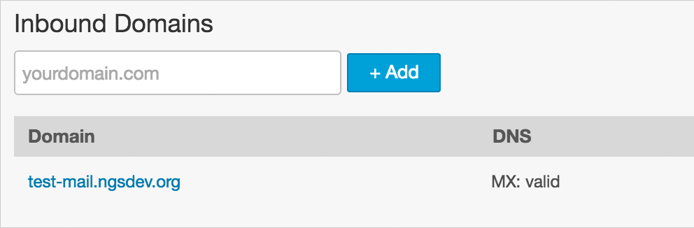

I've published an example [Nightwatch.js] End to End (E2E) testing project that contains Email delivery testing using [Mandrill] and [RequestBin].

**[ngs/nightwatch-mail-example on GitHub]**

This example project tests subscribing and unsubscribing [Hacker News Letter] user flow.

READMORE

The test code is like this:

```js
page
  .navigate()
  //
  // Create Mandrill Email Route
  .createEmailRoute(email)
  //
  // Fill in form
  .waitForElementVisible("@form")
  .clearValue("@email")
  .setValue("@email", email)
  .click("@submit")
  //
  // Navigate to completion screen
  .waitForElementNotPresent("@form")
  .assert.urlEquals(page.url + "almostfinished.html")
  //
  // Check Email with specified subject
  .assert.receivedEmailSubjectEquals(
    email,
    "Hacker Newsletter: Please Confirm Subscription"
  )
  //
  // Check Email contains specified string in HTML body
  .assert.receivedEmailHTMLBodyContains(
    email,
    '<a class="button" href="https://hackernewsletter.us1.list-manage.com/subscribe/confirm?u='
  );
```

[See full code](https://github.com/ngs/nightwatch-mail-example/blob/master/tests/hackernewsletter.js).

## Motivation

We recently introduced [Nightwatch.js] for End to End testing our product.

I think that is pretty easy and simple to writing test code for our web application.

While writing test, we wanted to test user flow through receiving Emails from our application.

So I tried to implement custom actions and assertions for [Nightwatch.js].

ref: [Extending Nightwatch - Nightwatch Developer Guide](http://nightwatchjs.org/guide#extending)

## Getting Started

### 1. Set up Mandrill Inbound Domain

First you need to set up _Inbound Email Domain_ by following [Mandrill Documentation].

Just type your domain and hit the blue _+ Add_ button on [Inbound Domains] screen.



After adding test domain, you need add MX record in your DNS records indicated in _MX Setup_ popup.


### 2. Grab your Mandrill API Key

Next you need to grab your Mandrill API Key from [settings screen]


I recommend turning on _Test Key_ checkbox that prevents sending Emails someone mistakenly while testing.

### 3. (Optional) Launch your RequestBin

Delivered Emails are shared with public users. If you mind sharing your application Emails for them, you can launch your own [RequestBin] on hosting services like [Heroku] or [IBM Bluexix] by deploying [Open Sourced RequestBin].

```sh
git clone git://github.com/Runscope/requestbin.git
cd requestbin

heroku create
heroku addons:add heroku-redis
heroku config:set REALM=prod

git push heroku master
```

### 4. Environment Variables

To launch the example project, export environment variables according to the above steps.

I use [direnv] to manage local environment variables.

```sh
echo "export MANDRILL_API_KEY=${YOUR_API_KEY_HERE}" >> .envrc
echo "export MAIL_DOMAIN=${YOUR_MAIL_DOMAIN_HERE}" >> .envrc

# If you set up your own RequestBin in Step 3
echo "export REQUEST_BIN_HOST=https://${YOUR_HEROKU_APP}.herokuapp.com" >> .envrc

# Allow new environment variables
direnv allow
```

### 5. NPM!

Finally, you can launch example test suite by running `npm` command.

```sh
npm install # for first time
npm test
```

## The Custom Assertions and Commands

The extension file layout is like this.

```sh
lib
├── custom_assertions
│   ├── receivedEmailHTMLBodyContains.js
│   ├── receivedEmailSubjectContains.js
│   └── receivedEmailSubjectEquals.js
├── custom_commands
│   ├── checkEmails.js
│   ├── createEmailRoute.js
│   └── deleteEmailRoutes.js
├── globals.js
└── page_objects
    └── hackernewsletter.js # example specific file
```

You need to specify these paths in [config file] (`nightwatch.json` by default).

```js
{
  "custom_commands_path": "./lib/custom_commands",
  "custom_assertions_path": "./lib/custom_assertions",
  "page_objects_path": "./lib/page_objects",
  "globals_path": "./lib/globals.js",
  // snip ...
}
```

## More Assertions

I added `receivedEmailHTMLBodyContains`, `receivedEmailSubjectContains`, `receivedEmailSubjectEquals` in this example project.

If you want to add assertions for other field like `from_email` or `attachments`, you can implement by forking existing implementations. (See [full list])

```js
const util = require("nightwatch/lib/util/utils");

exports.assertion = function receivedEmailSubjectEquals(
  address,
  expected,
  msg
) {
  const DEFAULT_MSG = 'Testing if <%s> received with subject equals to "%s".';
  this.message = msg || util.format(DEFAULT_MSG, address, expected);

  this.expected = function () {
    return expected;
  };

  this.pass = function (value) {
    const expected = this.expected();
    return (
      value.filter(function (email) {
        return email.subject === expected;
        // use indexOf(expected) !== -1 for *contains* implementation.
      }).length > 0
    );
  };

  this.value = function (result) {
    return result || [];
  };

  this.command = function (callback) {
    return this.api.checkEmails(address, callback);
  };
};
```

If you write some cool assertions in your project, please [fork the repository] and send me a Pull Request!

Happy testing!

[nightwatch.js]: http://nightwatchjs.org/
[ngs/nightwatch-mail-example on github]: https://github.com/ngs/nightwatch-mail-example
[hacker news letter]: http://www.hackernewsletter.com/
[mandrill]: https://mandrillapp.com/
[requestbin]: https://requestbin.com/
[mandrill documentation]: https://mandrill.zendesk.com/hc/en-us/articles/205583197-Inbound-Email-Processing-Overview#set-up-an-inbound-domain
[inbound domains]: https://mandrillapp.com/inbound
[settings screen]: https://mandrillapp.com/settings/index
[heroku]: https://www.heroku.com/
[ibm bluexix]: http://www.ibm.com/cloud-computing/bluemix/
[open sourced requestbin]: https://github.com/Runscope/requestbin
[direnv]: http://direnv.net/
[config file]: http://nightwatchjs.org/guide#settings-file
[full list]: https://mandrill.zendesk.com/hc/en-us/articles/205583197-Inbound-Email-Processing-Overview#inbound-events-format
[fork the repository]: https://github.com/ngs/nightwatch-mail-example/fork
