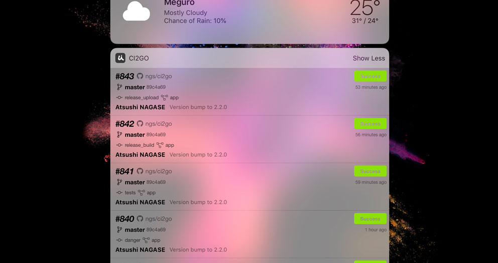

I've just released version 2.1.0 of [CI2Go], the [CircleCI] client for iPhone and iPad.

[][AppStore]

v2.1.0 contains the following:

- Today widget
- SSH connect
- Delete local artifacts
- Open application by URL

READMORE

## Today widget

You can add CI2Go widget to [Today] view. This shows recent 5 builds of selected project/branch or your following projects.

## SSH connect

`SSH` section will be shown while running SSH enabled builds if you installed SSH client which supports `ssh://` URI scheme such as Panic's [Prompt].

Launches SSH client when row of container was selected.

## Delete local artifacts

You can delete downloaded build artifacts from trash can icon which appears by swiping table rows left.

## Open application by URL

CI2Go now handles URI schemes: `chttps://`, `ci2go://`, `ci2go+https://`.

You can open CI2Go by replacing or prefixing protocol part of CircleCI build URL like:

[https://circleci.com/gh/circleci/frontend/3439] to [ci2go://circleci.com/gh/circleci/frontend/3439]

Send me [issues] if you have any.

[CI2Go]: https://itunes.apple.com/app/id940028427?mt=8
[AppStore]: https://itunes.apple.com/app/id940028427?mt=8
[CircleCI]: https://circleci.com
[issues]: https://github.com/ngs/ci2go/issues/new
[https://circleci.com/gh/circleci/frontend/3439]: https://circleci.com/gh/circleci/frontend/3439
[ci2go://circleci.com/gh/circleci/frontend/3439]: ci2go://circleci.com/gh/circleci/frontend/3439
[Prompt]: https://panic.com/prompt/
[Today]: https://support.apple.com/en-us/ht207122
