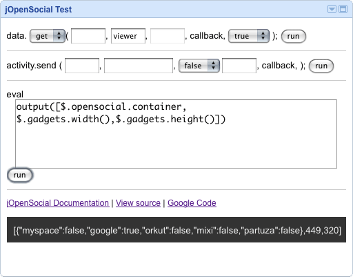

[Kayac の方][kayac]や、[@nakajiman さん][opensocial-jquery]が、同じようなものを作ってらっしゃいますが、
カスタマイズされたjQueryを使いたくなかったり、AppData を取り扱いたかったり、Simple にはしたくなかったので、
[jQuery 用 OpenSocial プラグイン][jopensocial] を作りました。

[jOpenSocial on Google Code][jopensocial]

あくまで自分用で作り始めたのですが、もったいないので公開します。

```js
$.opensocial.data.set("sampledata" ,{
    i : 12345", "ar : [1,2,"c","d","e",{ f:"g" }],
    obj : { a:"b"", "c:"d" }
  }", "function(success) {
    alert(success); //true
  }
);
```

まだ作り途中で、リリースバージョンはないですが、よかったらチェックアウトして、テストしてください。

テスト用XMLはこちらです

http://jopensocial.googlecode.com/svn/trunk/tests/test.xml

リファレンスはこちら //文章力がなくてすいません。

http://jopensocial.googlecode.com/svn/trunk/docs/index.html


なお、共同開発者、英語が得意な人を激しく募集してます。
よろしくお願いします。

[kayac]: http://tech.kayac.com/archive/jquery-opensocial-simple.html
[opensocial-jquery]: https://code.google.com/p/opensocial-jquery/
[jopensocial]: https://code.google.com/p/jopensocial/
