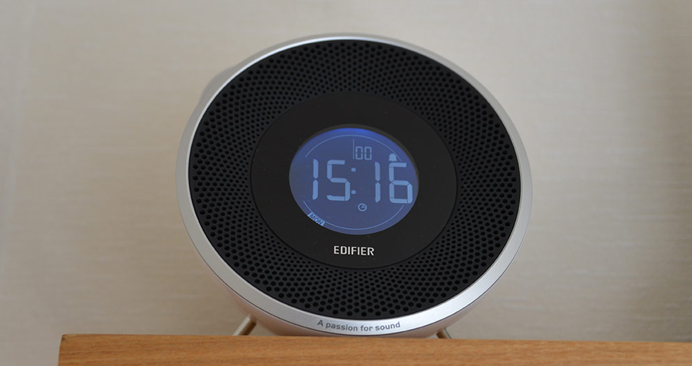
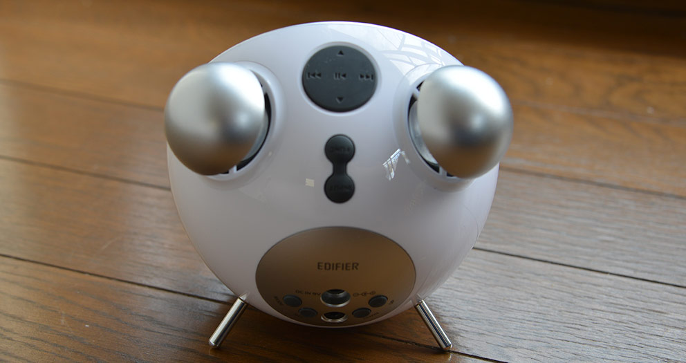

コンポを寝室に設置していた頃、目覚ましとして FM ラジオを On タイマーでつけていたのを思い出し、また同じことをやってみたくなったので購入しました。

&raquo; Amazon: [Edifier FMラジオ搭載目覚まし機能付Bluetooth対応スピーカー TickTock Bluetooth MF240BTシリーズ][ticktock]

<!--more-->

現在は何も無い部屋に家族4人で寝ているため、コンポを設置する場所がありません。

既に [JBL STATION MICRO II] を持っていたので、

* iPhone を繋ぐ
* [Local Notification] を使いアプリを起動する
* 直ぐに以下 Radiko を URL Scheme: [`radiko:` ](radiko:) で起動

    ```objc
    [[UIApplication sharedApplication] openURL:[NSURL URLWithString:@"radiko:"]];
    ```

みたいな DIY を企んでいましたが、[JBL STATION MICRO II] が信号を出さずに放っておくと、スリープし、それを自動で解除はできないのは突破できず、断念しました。

しかたがなく、色々 Amazon で物色して、一番良さそうだったものを購入しました。

&yen; 4,570 也。[JBL STATION MICRO II] と比べても遜色ないぐらい、音も、デザインも悪くないので、お買い得だと思います。

おかげで内製するコストが削減できました。





[JBL STATION MICRO II]: http://www.amazon.co.jp/gp/product/B003IPGZE4/ref=as_li_ss_tl?ie=UTF8&camp=247&creative=7399&creativeASIN=B003IPGZE4&linkCode=as2&tag=atsushnagased-22
[ticktock]: http://www.amazon.co.jp/gp/product/B00A663U1O/ref=as_li_ss_tl?ie=UTF8&camp=247&creative=7399&creativeASIN=B00A663U1O&linkCode=as2&tag=atsushnagased-22
[Local Notification]: https://developer.apple.com/library/ios/documentation/NetworkingInternet/Conceptual/RemoteNotificationsPG/Chapters/IPhoneOSClientImp.html
