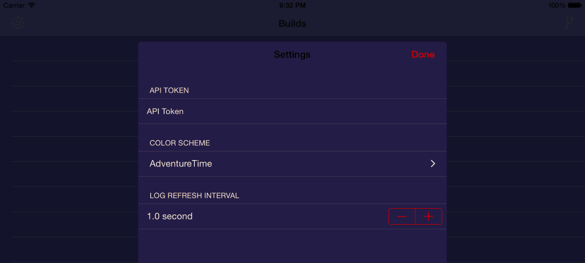

UIAppearance の proxy メソッドから見た目を変更して、即時全画面に適用する方法を調べていて、[UISS] という iOS で JSON 形式の Stylesheet を扱うライブラリにその答えがあったので、メモです。

READMORE

`window` の子ビューを全て剥がして貼り直しています。

`setNeedsDisplay`, `setNeedsLayout` も試してみましたが、動かなかったので、こちらを採用します。

Swift で書くとこんな感じです。

[UISS]: https://github.com/robertwijas/UISS
