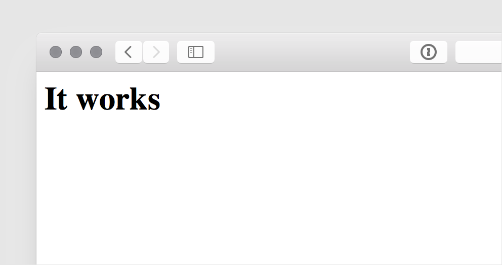

Heroku App を Docker でビルド + デプロイできる機能が Beta として公開されています。

https://devcenter.heroku.com/articles/docker

これがどんなものかを理解するために、手始めに nginx で静的サイトを捌く Image を作ってみました。

- [ngs/heroku-docker-nginx on GitHub](https://github.com/ngs/heroku-docker-nginx)
- [atsnngs/heroku-nginx on Docker Hub](https://hub.docker.com/r/atsnngs/heroku-nginx/)

READMORE

## Docker Image の使い方

使い方は至ってシンプルです。

[Heroku Toolbelt] が入っていなければそれを、その次に [Heroku Docker CLI plugin] をインストールします。

```sh
brew install heroku-toolbelt
heroku plugins:install heroku-docker
heroku login
```

プロジェクトを作成します。

```sh
echo 'web: ./nginx-start.sh' > Procfile
mkdir www
echo '<html><body><h1>It works</h1></body></html>' > www/index.html
heroku docker:init --image atsnngs/heroku-nginx
docker-compose build
```

`www` 配下が Document Root になっているので、その中にサイトを構築します。

ローカルでコンテナを立ち上げてブラウザで開いてみます。

```sh
docker-compose up web
open "http://$(docker-machine ip default):8080"
```

Heroku App を作ってデプロイします。 `heroku` コマンドを使うのに、
Git リポジトリである必要があるので、`git init` でリポジトリにします。

```sh
git init .
heroku create
heroku docker:release
heroku open
```

ブラウザで Heroku 上に動いているサイトが確認できたと思います。

## Image 構築でやっていること

Docker イメージを構築する上で、Heroku App の Slug に積まれるファイルは `/app` 配下である必要がありました。

参照: [Build and Deploy with Docker / Advanced uses](https://devcenter.heroku.com/articles/docker#advanced-uses)

`apt-get` でインストールしたパッケージや、`/etc` に入っている設定ファイルなどは、デプロイされません。

そのため、`/app/.heroku/nginx` をルートディレクトリに設定した nginx を自前でビルドして、
そのバイナリの Tarball を Image のビルド時にダウンロードしてくる様にしました。

```sh
RUN curl --silent --location https://github.com/ngs/heroku-docker-nginx/raw/master/nginx.tar.gz | tar xz -C /app/.heroku/nginx/sbin
```

## 所感

この様に、普通の Docker の使い方ができず、Buildpack の方が、シンプルで使いやすいです。

また、CircleCI の Docker Engine は 1.6 で、Docker Plugin が使っている `docker-compose` は 1.7 が要件に入っています。なので、CI ビルドから Docker Plugin でアプリケーションをリリースすることはできません。

諸々、Beta 卒業の頃には解決する問題だと願っていますが、敢えて、今 Heroku Docker を採用する理由はないと思いました。


[Heroku Toolbelt]: https://toolbelt.heroku.com/
[Heroku Docker CLI plugin]: https://github.com/heroku/heroku-docker
