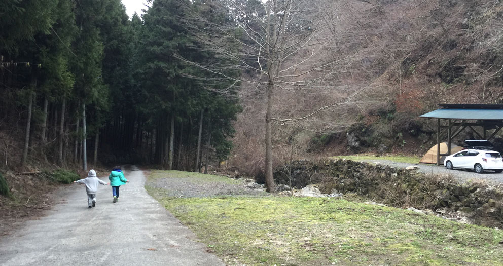
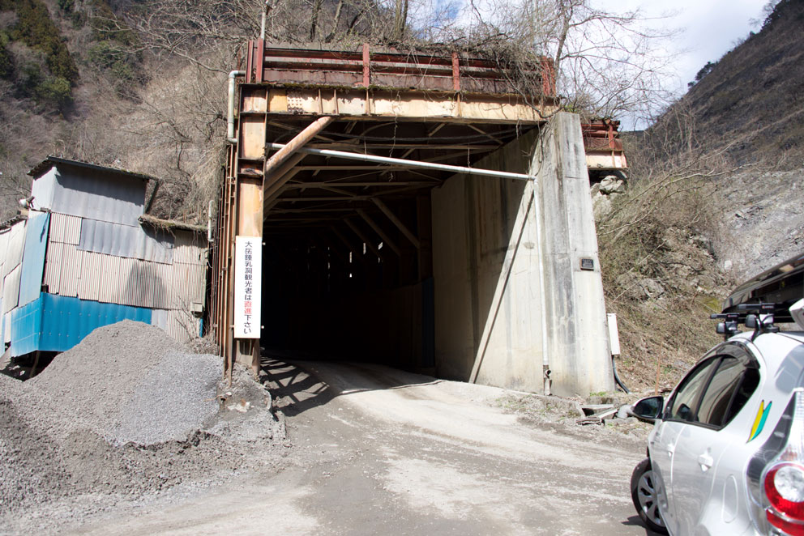
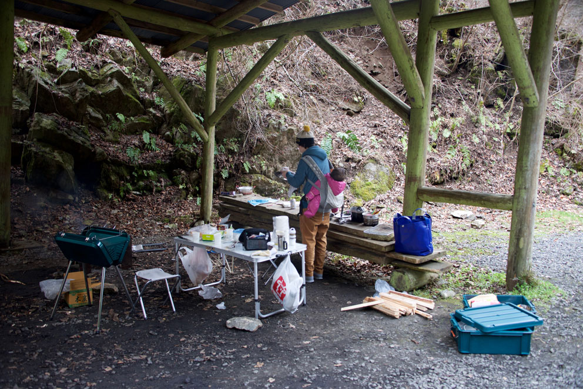
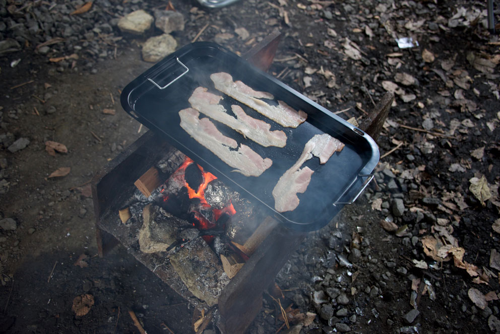
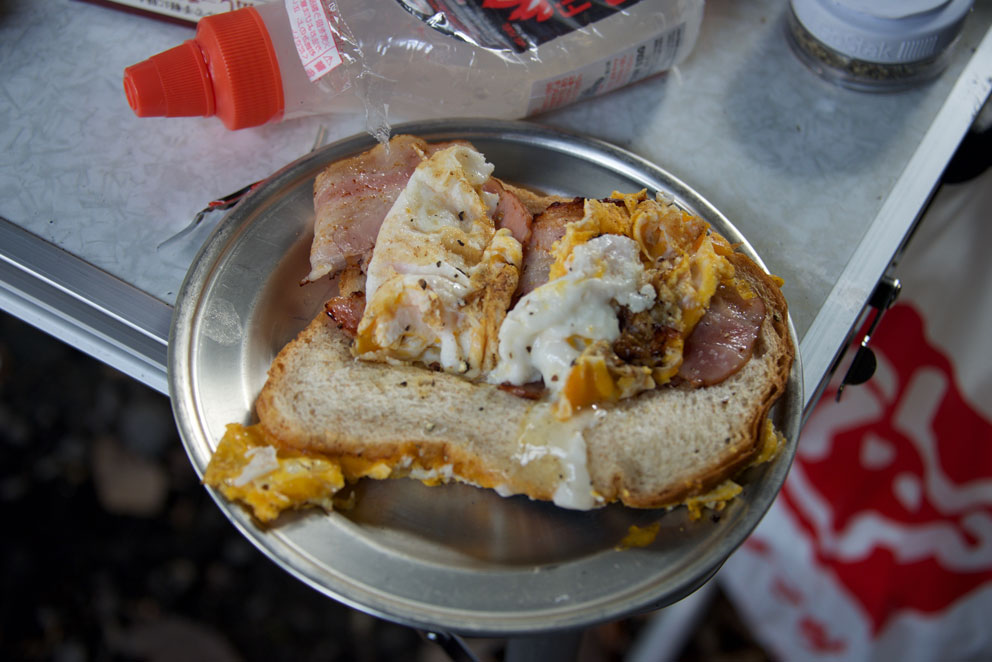
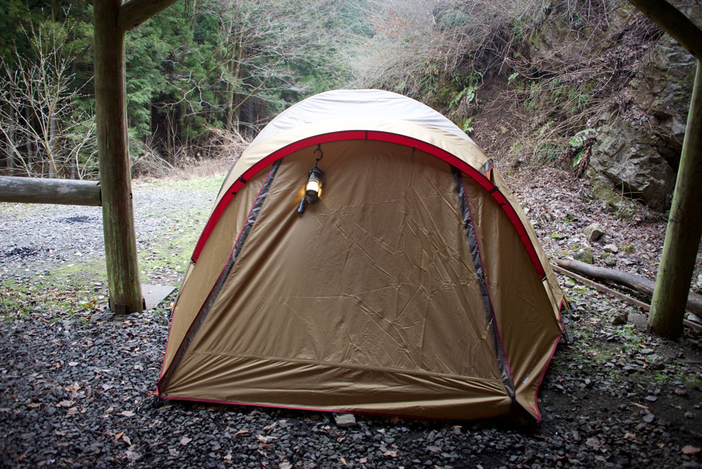
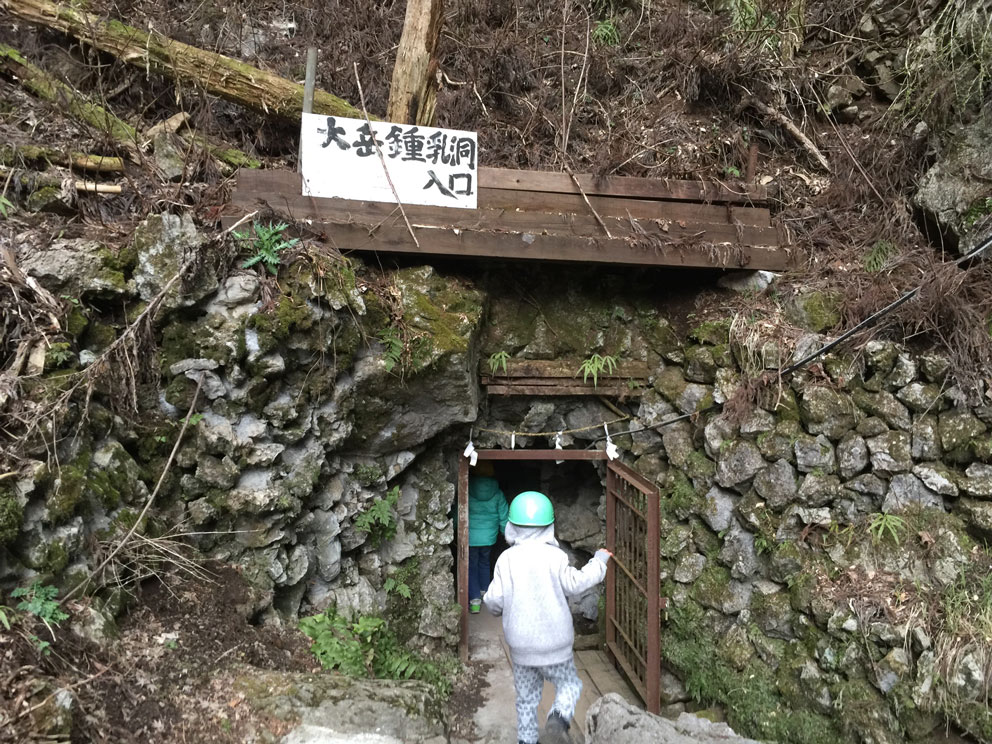
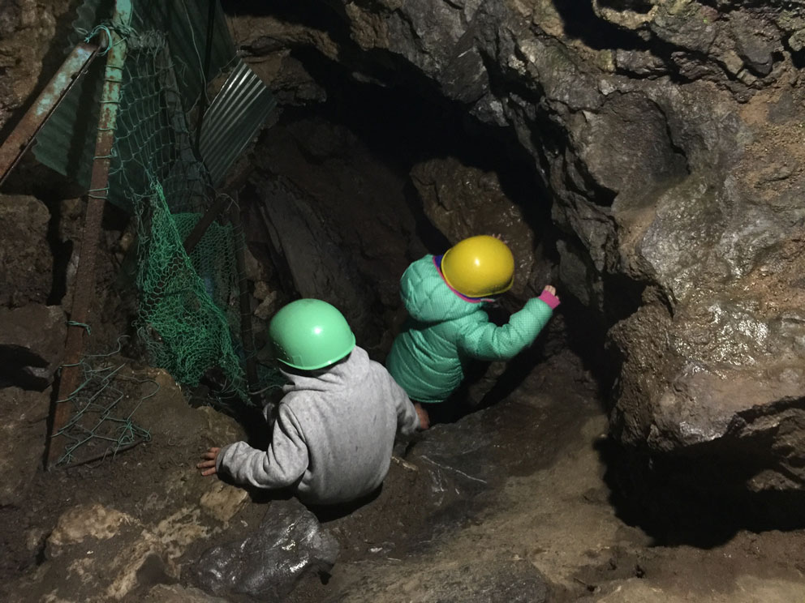

2016.03.26-27 の土日、初めて妻子を連れて東京都あきる野市の大岳山にあるキャンプ場で一泊しました。

[大岳鍾乳洞 大岳キャンプ場](http://ootakecave.com/)

READMORE

<iframe src="https://www.google.com/maps/embed?pb=!1m18!1m12!1m3!1d3237.524711398756!2d139.1559745156463!3d35.76248518017537!2m3!1f0!2f0!3f0!3m2!1i1024!2i768!4f13.1!3m3!1m2!1s0x60193ba92f5edd3d%3A0x6edc4a92cd4716b9!2z5aSn5bKz44Kt44Oj44Oz44OX5aC0!5e0!3m2!1sen!2sjp!4v1459683006829" width="100%" height="450" frameborder="0" style="border:0" allowfullscreen></iframe>

キャンプ場に向かってナビ通り進むと、こんな感じの採石場にたどり着き、

ここで本当に大丈夫か？と不安になりましたが、ナビを信じて、トンネルくぐると、キャンプ場が出てきます。

上流、下流にそれぞれキャンプサイトがあり、今回は新しい方の上流側サイトを利用しました。

小慣れない感じの散らかり方をしていますが、屋根のある場所が使えたので、そこを調理場として使いました。

下調べをしたところ、クチコミに _何もない_ と書かれていたを読んで警戒していましたが、水洗トイレや水回りなど、施設が綺麗だったので、とても使いやすかったです。

利用料金は

- 500 \* 5 人
- 1,500 (テント 1 張)
- 1,000 (車 1 台)

の計 5,000 円でした。

追加で 薪 500 円 \* 2、炭 1,000 円を購入しました。

薪が無くなりそうだったので、付近に落ちている杉の枯れ枝などで補填しましたが、問題なく 1 泊 2 食作ることができました。

薪、炭用のブロックみたいなのが、そこら辺に放置されているので、網と鉄板だけあれば、バーベキューグリルなどは必要なかったです。

これは朝食用のベーコン。焚き火の中には、濡れた新聞紙とアルミ箔で包んだジャガイモ。美味でした。

朝食のトースト。見た目がとても悪いですが、味は美味でした、ほぼシチュエーションですが。。

現地で洗って乾かしていると、10AM のチェックアウトに間に合わないので、食器は拭きとってプラコンテナに詰め込み、家に帰って洗いました。

今回、初家族キャンプなので、新調したテント。[snow peak アメニティードーム L](http://www.amazon.co.jp/gp/product/B00JREZGPE/ref=as_li_ss_tl?ie=UTF8&camp=247&creative=7399&creativeASIN=B00JREZGPE&linkCode=as2&tag=atsushnagased-22)。

## 大岳鍾乳洞

キャンプ場の事務所の左側には、大岳鍾乳洞入り口があります。事務所で受付と入洞料金を支払うと、ヘルメットを貸してもらえます。

洞窟内はとても狭く、抱っこをされた子供は連れて入れないので、下の娘と妻はサイトに残し、小 2 の娘と、幼稚園年中の息子を連れて入洞しました。

25 箇所の名所を順番に見て回り、逆戻りして入り口から出ます。

終始中腰で腰が痛かったですが、子どもたちは楽しんでくれました。もちろん、自分も楽しかったです。

