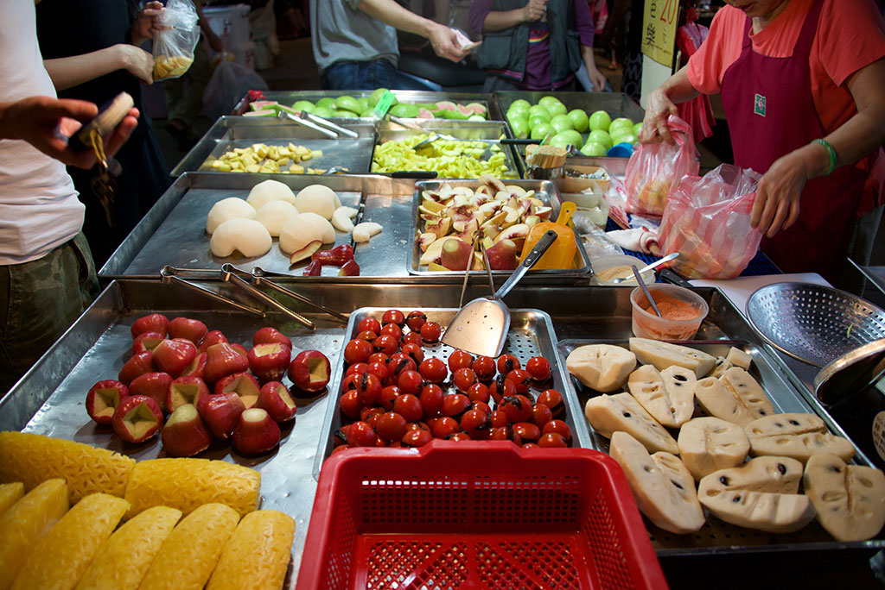
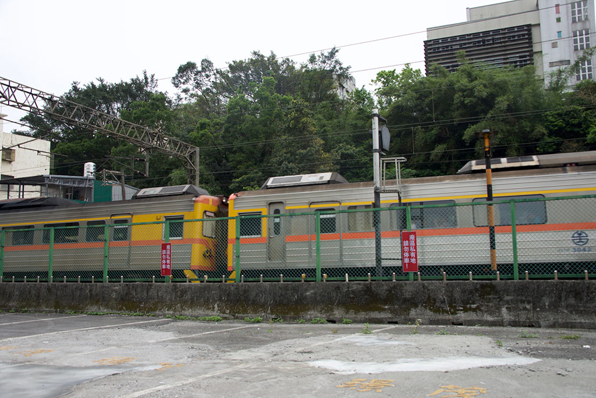
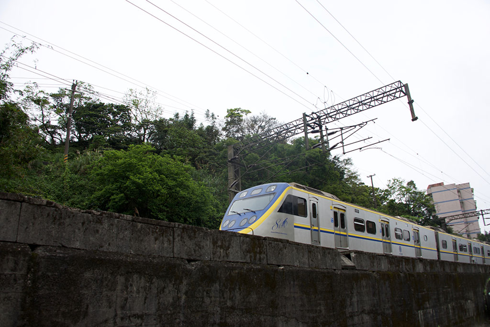
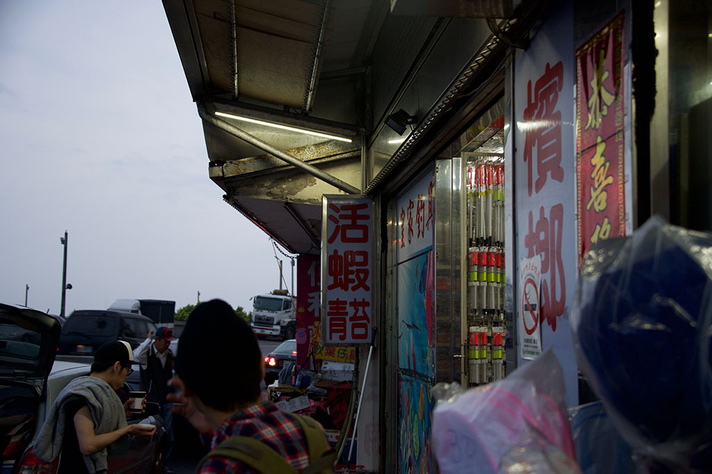
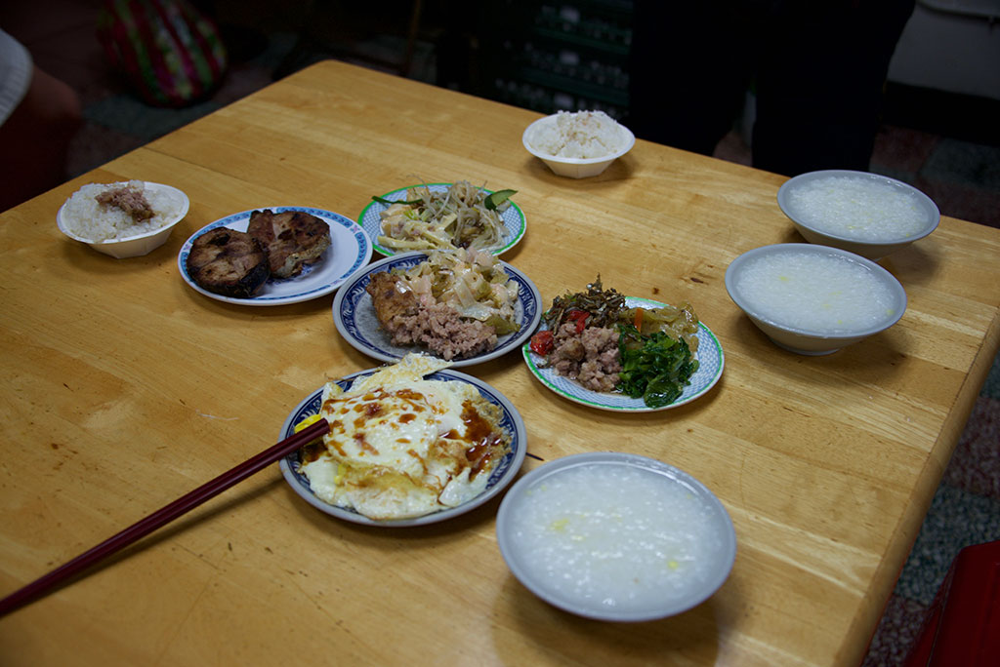
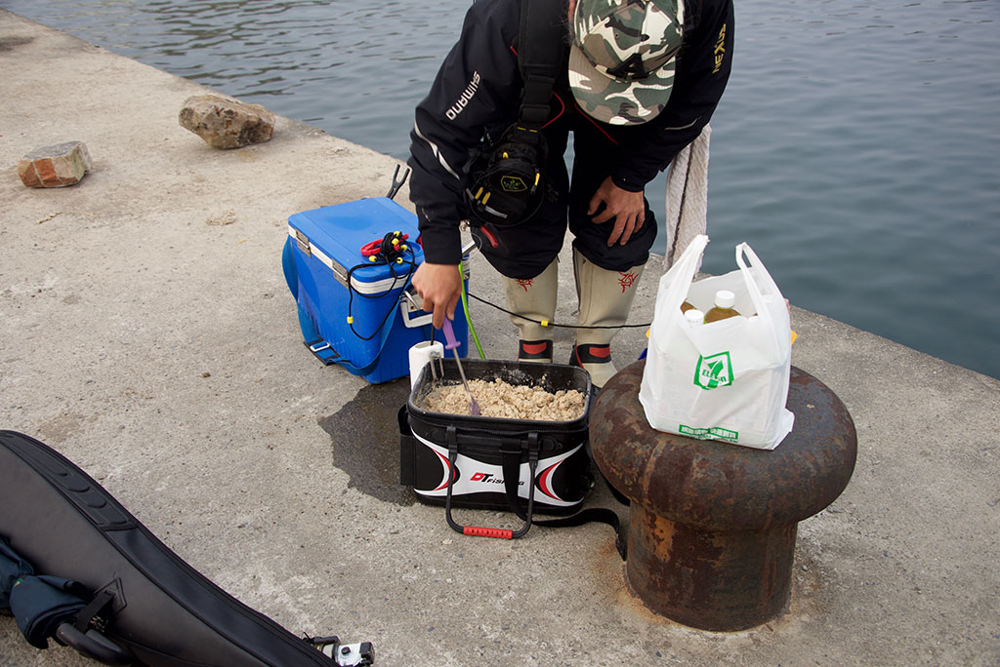
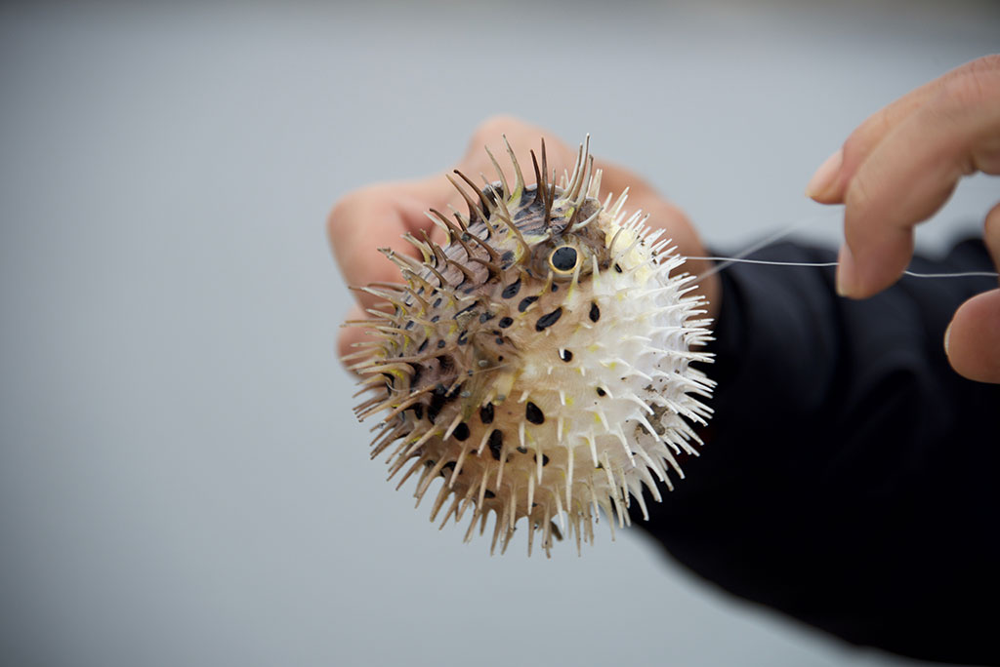
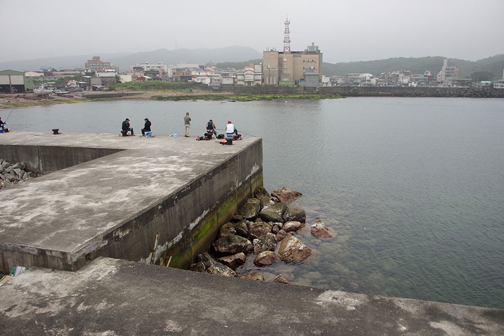

2016/04/06-10 台湾を旅行しました。[前回の家族との旅行]から約2年半ぶり、人生3度目の台湾旅行です。

今回は、同僚のデザイナー [Carlos Liu] の日本移住にともなう事務処理やら何やらで一時帰国するのに便乗しました。

写真は、彼のアパートの近くにある **臨江街夜市** (トンホァ夜市)。士林以外の夜市は初めて訪れました。

READMORE

**台北ドーム** (大巨蛋)。建築法違反が建築途中に発覚し、建設が頓挫したらしいです。[参照](http://japan.cna.com.tw/news/asoc/201505210007.aspx)

前回訪れた時は、フェンスしか見えなかったのですが、知らないうちにこんなに巨大な屍が。。

台北ドームの隣りにある、**松山文創園区**。もともとタバコ工場だったものを、商業施設としてリノベーションしたものらしいです。

タバコ工場外観。

台北地下街の文字化けした電光掲示板。

臨江街夜市のレストランで食べた **臭豆腐** と **鴨血**。

露天で売られているフルーツ。前回、美味で感動した **釈迦頭** (写真右下) を買いました。

2日目朝食に、 **無名子清粥小菜** というお店で、大好物の台湾お粥 **清粥小菜** を頂きました。

アパートからの風景。

同じく、アパートからの風景。

九份に行って観光。前回と異なり、綺麗に晴れていたので幸運でした。

台北市内には戻らず、ユースホステルに一泊。一泊 23USD/人 でした。

https://www.airbnb.jp/rooms/11911916

拜拜。

タクシーの中から撮影 DR2907。

タクシーの中から撮影 EMU800。

4日目の土曜日は、Carlos のお父様に **貢寮區澳底漁港** という場所に磯釣りに連れて行っていただきました。

この日も朝食に清粥小菜に連れて行って頂きました。

**早點 清粥小菜** と書いてある看板の写真を撮っていますが、ネット検索しても該当するお店が見つけられず。

自力で再訪問するのはかなりの難易度だと思います。

手作りの小菜達。美味でした。

撒き餌。

ハリセンボンが連れました。かわいい。

怒るとこうなります。食用には適さないので、逃がしてあげました。

[前回の家族との旅行]: /2013/12/22/taipei/
[Carlos Liu]: http://carlos-liu.com/
