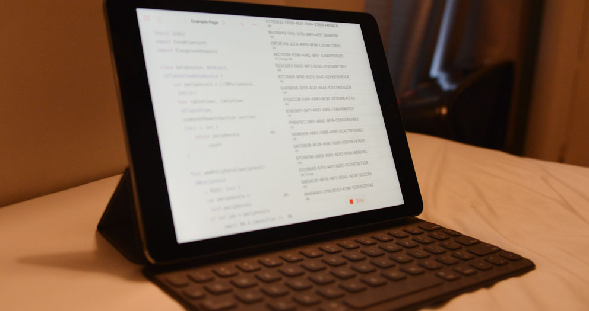

[先の投稿]で所感を述べた通り、[Swift Playground for iPad] の発表に感銘を受けたので、早速遊び始めています。

まず最初に作ったのは、[Core Bluetooth] の API を使用して、周辺の Bluetooth 機器の一覧を UITableView で表示するサンプルです。Playground Book の形式で GitHub に公開しました。

**[ngs/Playground-Bluetooth-Book][repo]**

Core Bluetooth に関して、全く触ったことが無かったので、[@shu223 さんの Qiita 投稿] を参考にさせて頂きました。

今回は一覧まででしたが、ちょうど良いデバイスが入手でき次第、実際にデータの送受信を行える様にしようと思います。

このプロジェクトを進化させて、ラップトップを持ち歩かなくても、Bluetooth デバイスとブレッドボード、iPad だけで気軽にスケッチが作られるようになればな、と思っています。

READMORE

## 動作デモ

## 必須環境

開発者プレビューで公開されている、iOS 10 beta がインストールされている iPad 必要になります。

[Apple 開発者サイトの Download ページ] からインストーラーをダウンロードし、インストールして下さい。

## Playground Book の iPad への転送方法

以下の手順が面倒だったら、[Swift コード]を Blank プレイグラウンドにコピペするだけでもお試し頂けます。

- [最新の ZIP アーカイブ] をダウンロードして解凍するか [リポジトリ][repo] を Git でクローンします。
- iPad の AirDrop を有効にします。
- Finder で <kbd>&#x2318; + &#x21E7; + R</kbd> を入力して AirDrop のウィンドウを開きます。
- `Bluetooth.playgroundbook` を iPad のアイコンにドロップします。
- iPad 上で開くアプリケーションの選択を尋ねられるので、_Playground_ を選択します。

## 参考

- [WWDC 2016 Videos / Introducing Swift Playgrounds](https://developer.apple.com/videos/play/wwdc2016/408/)
- [Playground Book Package Format](https://developer.apple.com/library/prerelease/content/documentation/Xcode/Conceptual/swift_playgrounds_doc_format/index.html)

[先の投稿]: /2016/06/14/wwdc-2016-keynote/
[Swift Playground for iPad]: https://developer.apple.com/swift/playgrounds/
[Core Bluetooth]: https://developer.apple.com/library/ios/documentation/NetworkingInternetWeb/Conceptual/CoreBluetooth_concepts/AboutCoreBluetooth/Introduction.html
[@shu223 さんの Qiita 投稿]: http://qiita.com/shu223/items/78614325ce25bf7f4379
[repo]: https://github.com/ngs/Playground-Bluetooth-Book
[最新の ZIP アーカイブ]: https://github.com/ngs/Playground-Bluetooth-Book/archive/master.zip
[Apple 開発者サイトの Download ページ]: https://developer.apple.com/download/
[Swift コード]: https://github.com/ngs/Playground-Bluetooth-Book/raw/master/Bluetooth.playgroundbook/Contents/Chapters/Get%20Started.playgroundchapter/Pages/List%20Devices.playgroundpage/Contents.swift
