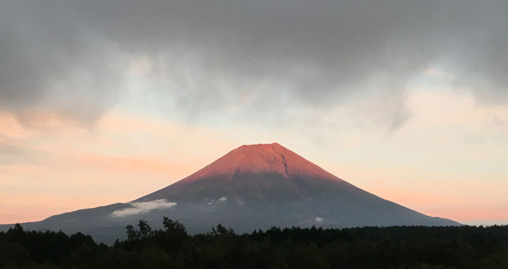
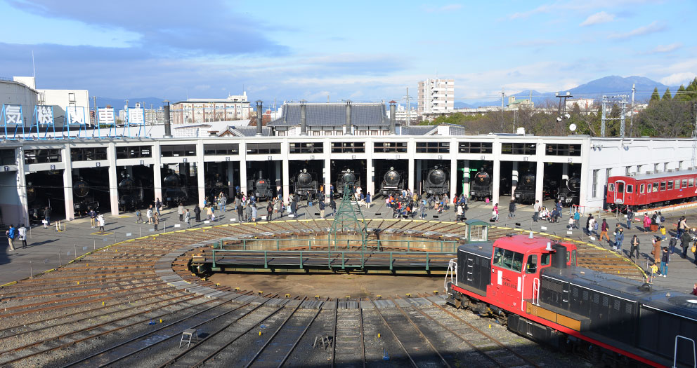

今年は、家族で2013年以来、3年ぶりに母方の祖母が住む、尾道で家族と大晦日を迎えています。

今年は大きな変化がなく、主に仕事にパワーを割いていました。

READMORE

## 仕事・技術

[Oneteam Inc.] での仕事は、主製品の Oneteam の開発を行っていたところから、徐々に新事業の模索や、顧客へのヒアリング・導入提案をビジネスチームと一緒に行い、内部の開発チームに起案・設計する、という業務を行っていました。

来年も引き続き、顧客とのコミュニケーションと設計の業務を行う予定です。

[WWDC に参加した](/2016/06/14/wwdc-2016-keynote/) 直前後では、Server Side Swift や Playground についての研究もおこなっていましたが、業務内容が Swift と関係ない部分を担当するようになり、暫くさわっていない状態が続いています。

趣味で開発している [CI2Go] の Swift 3 化でリハビリを行っていますが、なかなか往生しておる次第です。

新たに業務・趣味で使い出したのが [Go 言語] で、もともと触っていた Perl や Ruby と比べて、開発環境が充実しているのと、ライブラリの依存解決方法が中枢でない点がとても扱いやすく、メンテナンスが止まっている小さいプロジェクトや、趣味のプロジェクトを徐々に移行しています。

- [買い物チャット](/2016/12/11/line-buychat/)
- [Wiplock](/2016/09/23/wiplock/)

### 執筆

はじめて技術書の執筆に共著で参加させていただきました。

[Slack 入門 [ChatOps によるチーム開発の効率化]](/2016/06/22/slack-book/)

### 登壇

以下のイベントでの登壇を行いました。

- [02/10 Meguro.es #2 in Drecom](/2016/02/11/how-oneteam-deliver/)
- [02/16 dots.](/2016/02/16/dots-slide/)
- [04/13 Collaboration Hack Meetup](/2016/04/14/document-driven-development/)
- [06/10 CircleCI Meetup](/2016/06/10/circleci-meetup/)
- [06/22 WWDC 2016 の振り返り勉強会](/2016/06/22/finc-wwdc-2016/)
- [06/27 Tokyo Server-Side Swift Meetup #4](/2016/06/29/tsss4/)
- [07/05 「Slack入門」刊行記念LT大会](/2016/07/05/slack-book-lt/)

ならべてみると、今年後半は対外活動が控えめだったので、もうすこし、コンスタントにそとに出て話をできるよう、ネタ集めを行っていこうと思います。

## 旅行

ことしは車を使い始めたこともあり、家族での移動が増え、週末は充実していました。

特に、今まで電車で行き辛かった場所へもキャンプ用具一式をもって家族ででむくことができたのはライフチェンジングでした。いつも一人で参加しているフェスに、妻子と参加もできました。

- 02/27-29 水上高原
	- 長女の誕生日祝いにスキーへ行きました。
	- 次女がインフルエンザにかかり、長女・長男と共に上越新幹線で
- [03/26-27 大岳山キャンプ場](/2016/03/27/odake-camp/)
	- あきる野市にある大岳山キャンプ場に行ってきました。
- [04/06-10 台北](/2016/04/11/taiwan/)
	- 今年1月からジョインしてくた、台湾人デザイナー Carlos Liu の帰省+事務手続きに便乗して台北に行きました。
- 05/14-15
	- 横須賀市の IT 企業補助プログラムのサポートにより、会社のメンバーと開発合宿を行いました。
	- http://www.yokosukaitcamp.com/
- 06/04-05 Taicoclub
	- ひとりで車で参加しました。
	- http://taicoclub.com/16/
- [06/13-20 WWDC](/2016/06/14/wwdc-2016-keynote/)
	- WWDC 2012 より 4年ぶりに Moscone West の WWDC に参加してきました。
	- 毎度、素敵な出会いと再会があるので、素晴らしいカンファレンスです。来年も本体当選せずとも参加しようと思います。
- 07/02-03 宮原オートキャンプ場
	- 千葉県いすみ市にある宮原オートキャンプ場で一泊キャンプをおこないました。
	- 近くに [ポッポの丘ギャラリー] という古い鉄道車両が (野ざらしで) 展示されているスポットがあり、息子と自分は楽しめました。
	- http://www.camp-miyahara.com/
- 07/30-08/01 北海道
	- 同僚と [第30回苫小牧ハスカップトライアスロン大会in勇払] に参加すべく北海道にいきました。
	- スイムでリタイアしました。
- 08/12-14 兵庫県竹野
	- 両親と家族で竹野休暇村に2泊2日で海水浴旅行にいきました。
- 09/10-11 Sawagi Festival @ 山中湖撫岳荘
	- はじめて家族と泊まりがけ音楽フェスに参加しました。
	- http://www.sawagifes.com/
- 10/01-02 CAMP Off Tone @ マウントピア黒平
	- 甲府にある マウントピア黒平 で行われている [CAMP Off Tone] に参加しました。
	- http://www.offtone.in/camp/
- 10/08-09 朝霧 JAM
	- こちらも初参加です。ものすごい濃霧の中のフェスでした。
	- http://smash-jpn.com/asagiri/

釣りもそれなりに行って時間を割いていたのですが、こちらに残せるほどの結果を残せていないので、割愛します。

来年もこりずに釣行いこうと思います。

## 音楽

- [04/24 小豆 バンド @ Live cafe Again](https://twitter.com/kunihonk/status/723039184424816641)
	- 近所のバー Octant 常連の三味線の先生率いる限定バンドライブ。素晴らしかった。
- [05/03 Pacha Tokyo 2016 @ 晴海客船ターミナル](http://www.pachafestivaltokyo.com/)
- [05/30 くるり NOW AND THEN vol.3 @ 神奈川県民ホール](http://www.quruli.net/news/%E3%81%8F%E3%82%8B%E3%82%8A%E3%80%81%E7%B5%90%E6%88%9020%E5%91%A8%E5%B9%B4%E3%81%B8%E5%90%91%E3%81%91%E3%81%A6%E9%96%8B%E5%82%AC%E4%B8%AD%E3%81%AE%E3%82%B3%E3%83%B3%E3%82%BB%E3%83%97%E3%83%88%E3%83%A9/)
- [06/04-05 Taicoclub @ こだまの森](http://taicoclub.com/16/)
	- 雨の中の Tycho がすばらしかった
- [09/03 EMMA HOUSE](http://www.clubberia.com/ja/events/256443-EMMA-HOUSE/)
- [09/10-11 Sawagi Festival @ 山中湖撫岳荘](http://www.sawagifes.com/)
- [09/16 Tony Humphries Japan Tour 2016 'Soundbite' Feat. Tony Humphries @ Contact Tokyo](https://www.residentadvisor.net/event.aspx?868947)
- [10/01-02 CAMP Off Tone @ マウントピア黒平](http://www.offtone.in/camp/)
- [10/08-09 朝霧 JAM](http://smash-jpn.com/asagiri/)
- [10/21 David Morales Japan Tour](https://jp.residentadvisor.net/news.aspx?id=36526)
- [11/19 Masters At Work @ ageha](http://mawinjapan.com/)

前述の旅行と重複する部分もありますが、上記の様なイベントに参加してました。

充実していたと思います、来年も懲りずによい音楽を聴いていきたいと思います。

晴海埠頭での開催が最後だった [Body and SOUL Tokyo 2016](http://www.bodyandsoul-japan.com/) が WWDC へのフライトと調整がつかず、とても楽しみにしていた [A Hundred Birds Orchestra 20th Aniversary 東京公演](http://ahbproduction.com/2016/09/01/2016-12-26-mon-a-hundred-birds-orchestra-20%E5%91%A8%E5%B9%B4%E6%B8%8B%E8%B0%B7o-east-%E6%9D%B1%E4%BA%AC/)　が体調不良に参加できなかったのがとても悔やまれます。

## 健康

今年10月ごろから徐々にランニング通勤の回数が減ってきて、年末はほぼ電車通勤 (かつ寝不足か二日酔い) の時期がつづき、年末は風邪でダウンしてしまったため、来年は体力維持と規則正しい生活 (そしてあわよくば何かしら大会のリザルト) をのこせるといいなと思います。

## 家族

今年で長男が幼稚園を卒園するので、毎朝お迎えは次女が入園するまでの1年間お休みになります。

毎回思いますが、ついこの間まで赤ちゃんだったのが、小学校にあがりそれぞれ、友達ややりたいことを見つけて親から離れていくのは寂しくも思います。

来年も、彼らに負けないぐらいアクティブに一年を過ごしたいと思います。

[Oneteam Inc.]: https://one-team.com/
[CI2Go]: https://ci2go.com/
[Go 言語]: http://golang-jp.org/
[ポッポの丘ギャラリー]: http://keiranbokujo.com/custom1.html
[第30回苫小牧ハスカップトライアスロン大会in勇払]: http://tomakomait.wixsite.com/30hasukappu
