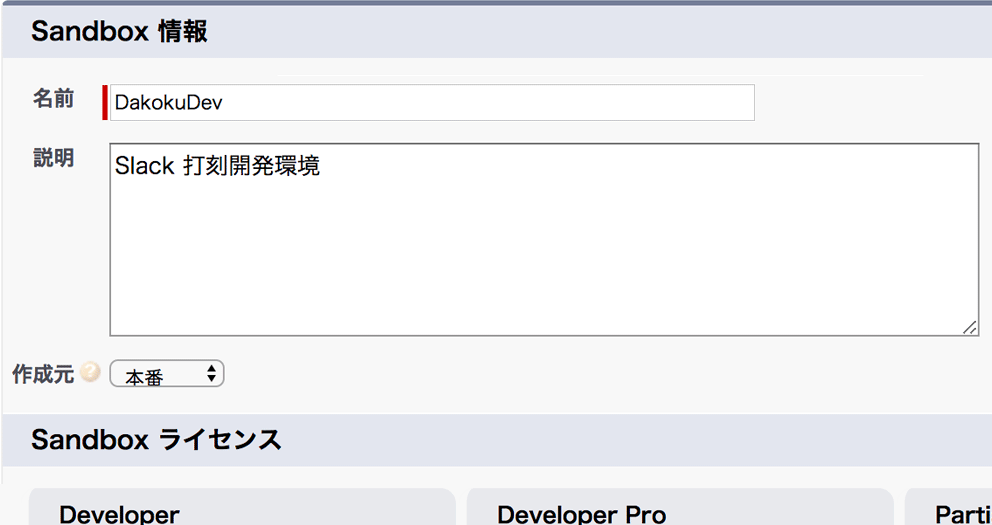
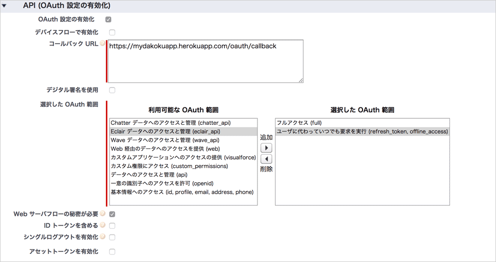
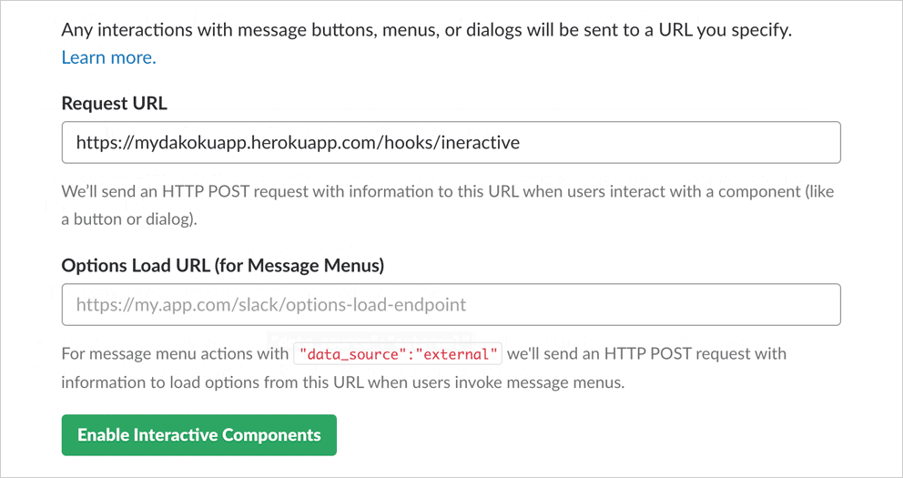

[CAMPFIRE] の従業員は、勤怠・経費・工数などの管理を [TeamSpirit] を使って行っています。

勤怠情報は SalesForce [Force.com] 上にインストールされた TeamSpirit の勤怠管理画面などから行います。

ref: [【利用環境・機能】知っていると得をする！チームスピリットと Force.com との関係を理解しよう！](https://www.teamspirit.co.jp/blog/staff/2013/07/teamspirit-forcecom.html)

勤怠情報は、毎日リアルタイムに付けないと、月末にまとめて、過去を振り返って記入する必要があり、従業員に負荷がかかっています。

この打刻作業を毎日習慣づけて、負荷なく行うため、いつも使っている Slack のコマンドで行える、Slack のアプリケーションを作成しました。

ソースコードは GitHub 上で公開しています。

TeamSpirit と Slack を利用している企業であれば、Heroku などを使ってアプリケーションを立ち上げ、全ての従業員が利用できます。

ref: [ngs/ts-dakoku][repo]

以下に導入手順を記載します。

READMORE

## 手順

1. TeamSpirit が動く Force.com 環境から Sandbox 環境を作成する
2. Sandbox に Apex のソースコードを追加する
3. Sandbox より、送信変更セットを使い、Apex コードを本番環境にアップロードする
4. TeamSpirit 本番環境で _接続アプリケーション_ を作成する
5. Slack でアプリケーションを作成する
6. アプリケーションを Heroku 上にデプロイする

## 1. Force.com Sandbox 環境を作成する

TeamSpirit は外部に公開されている API がありません。

そこで、Force.com に Apex REST のエンドポイントを作成します。

ref: [Creating REST APIs using Apex REST](https://developer.salesforce.com/page/Creating_REST_APIs_using_Apex_REST)

TeamSpirit が動いている本番環境の Force.com では、Apex クラス、トリガーなどの開発資材を直接作成することはできません。

_[設定]_ 画面より、 _リリース_ > _Sandbox_ 画面を表示し、 _新規 Sandbox_ ボタンをクリックして、Sandbox 環境を作ります。

_名前_ と _説明_ 欄には **任意の内容** を入力し、 _Sandbox ライセンス_ は **Developer** を選択します。

次にでてくる、 _Sandbox オプション_ の _Apex クラス_ は空欄のまま、 _作成ボタン_ をクリックします。

しばらくすると、Sandbox 環境の使用準備が整った旨のメールが届きます。

メールに記載されているログイン URL を開き、ログインユーザ名の欄に、TeamSpirit のログインメールアドレスの末尾に小文字で Sandbox 環境名、パスワードは TeamSpirit と同じものを入力し、ログインします。

## 2. Sandbox に Apex のソースコードを追加する

Sandbox 環境画面右上にある、ログインユーザーの名前をクリックし、ナビゲーションを展開、 _開発コンソール_ を開きます。

管理コンソール左上メニューバーから _File_ > _New_ > _Apex Class_ を選択し、 `TSTimeTableAPIController`, `TSTimeTableAPIControllerTest` という名前の Apex クラスを作成します。

コードエディター上に、それぞれリポジトリからコピーしたソースコードを貼り付け、保存します。

[ts-dakoku/apex/src/classes at master · ngs/ts-dakoku](https://github.com/ngs/ts-dakoku/tree/master/apex/src/classes)

リポジトリ内の `apex` ディレクトリは [Force.com IDE] のプロジェクトとしても取り込んで利用することができます。

## 3. 本番環境に Apex クラスをアップロードする

_[設定]_ 画面より、 _リリース_ > _送信変更セット_ 画面を表示し、 _新規_ ボタンをクリックして、新しい変更セットを作成します。

_変更セットコンポーネント_ セクションにある、 _追加_ ボタンより、資材選択画面を表示、Apex クラス `TSTimeTableAPIController`, `TSTimeTableAPIControllerTest` を選択し、 _変更セットに追加_ ボタンをクリックします。

_変更セットコンポーネント_ セクションに、選択した Apex クラスが表示されていることを確認したら、 _アップロード_ ボタンをクリック、次の画面で _対象組織_ から _本番_ を選択し _アップロード_ ボタンをクリックします。

しばらくすると、変更セットのアップロードが成功した旨のメールが届きます。

TeamSpirit 本番環境の _[設定]_ 画面より _リリース_ > _受信変更セット_ 画面を表示し、 _リリース待ちの変更セット_ セクションより、該当の変更セットを選択、_リリース_ ボタンをクリックし、次の画面の _テストオプションの選択_ から _デフォルト_ を選択、 _リリース_ ボタンをクリックします。

反映が終わると、 _[設定]_ 画面より、 _開発_ > _Apex クラス_ に `TSTimeTableAPIController`, `TSTimeTableAPIControllerTest` が追加されます。

`TSTimeTableAPIController` を選択し、 _セキュリティー_ ボタンをクリック、 _有効にされたプロファイル_ に全てのプロファイルを追加し、保存してください。

## 4. Force.com _接続アプリケーション_ を作成する

TeamSpirit 本番環境の _[設定]_ 画面より、 _ビルド_ > _作成_ > _アプリケーション_ 画面を表示し、 _接続アプリケーション_ セクションの _新規_ ボタンをクリック、 _新規接続アプリケーション_ 画面を表示します。

_基本情報_ セクション内 _接続アプリケーション名_ , _API 参照名_ , _取引先責任者 メール_ は任意の内容を入力します。

_API (OAuth 設定の有効化)_ セクション内 _OAuth 設定の有効化_ チェックボックスをオンにし、入力項目を展開します。

_コールバック URL_ は、後述のアプリケーションデプロイ先を URL を元に、 `https://{ホスト名}/oauth/salesforce/callback` の形式で入力します。

_選択した OAuth 範囲_ は、 _フルアクセス (full)_ , _ユーザに代わっていつでも要求を実行 (refresh\_token, offline\_access)_ を選択します。

上記を入力した上、保存ボタンをクリックします。

アプリケーション詳細画面に遷移するので、 _API (OAuth 設定の有効化)_ セクションより、 _コンシューマ鍵_ , _コンシューマの秘密_ の内容をテキストファイルなどに保存しておきます。

## 5. Slack でアプリケーションを作成する

Slack の API サイトを開き、 _Create New App_ ボタンをクリック、 _App Name_ と _Developer Slack Workspace_ を入力し、Slack アプリケーションを作成します。

_Add features and functionality_ のセクション内にある、 _Slash Commands_ と _Interactive Components_ を設定します。

### Slash Commands

_Slash Commands_ 画面より、 _Create New Command_ ボタンをクリック、新規作成画面で以下のように入力します。

- Command: `/ts`
- Request URL: `https://{ホスト名}/hooks/slash`
- Short Description (任意): 例: `TeamSpirit で打刻します`

### Interactive Components

_Interactive Components_ 画面で、 _Enable Interactive Components_ ボタンをクリック、 _Request URL_ に `https://{ホスト名}/hooks/interactive` のフォーマットで URL を入力し、緑の _Enable Interactive Components_ ボタンをクリックし、保存します。

### アプリケーションをインストール

_Install your app to your workspace_ セクションを展開し、 _Install App to Workspace_ ボタンをクリックします。

_App Credentials_ より、 _Verification Token_ をコピーし、先程コンシューマー鍵を保存したテキストファイルに貼り付け、保存します。

## 6. アプリケーションをデプロイする

ここでは Heroku を使ってホスティングする例を記載します。

[GitHub リポジトリ][repo] の README 内にある、 _Deploy to Heroku_ ボタンをクリックし、Heroku のアプリケーション設定を入力画面を開きます。

_Config Variables_ セクション内の環境変数欄にこれまでテキストファイルに保存していた情報を入力します。

以上で設定は完了です。

お使いの Slack ワークスペースで `/ts` コマンドを実行してみてください。

導入でお困りのことがありましたら、[連絡先] か [Twitter] などでお気軽にお問い合わせください。

バグ報告は [GitHub Issues] に起票頂けると幸いです。

[TeamSpirit]: https://www.teamspirit.co.jp
[CAMPFIRE]: https://campfire.co.jp
[Force.com]: https://developer.salesforce.com/platform/force.com
[Force.com IDE]: https://developer.salesforce.com/page/Force.com_IDE
[repo]: https://github.com/ngs/ts-dakoku
[連絡先]: /about/#contact
[Twitter]: https://twitter.com/ngs
[GitHub Issues]: https://github.com/ngs/ts-dakoku/issues

