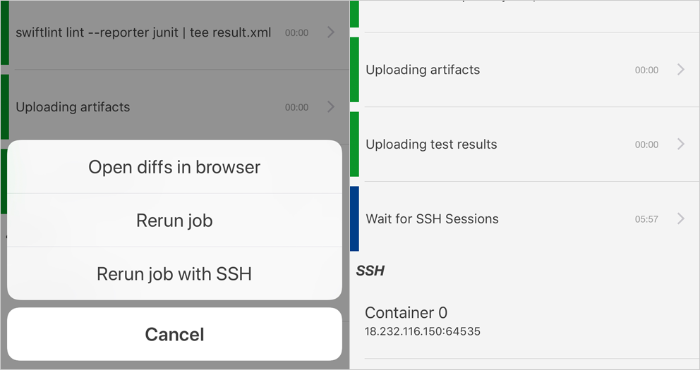
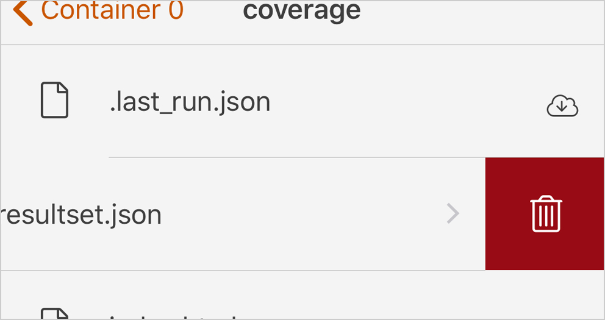

iPhone と iPad 向け [CircleCI] クライアント  [CI2Go] バージョン 2.1.0 を公開しました。

[][AppStore]

バージョン 2.1.0 は以下の更新を含みます:

- Today ウィジェット
- SSH 接続
- 端末上の成果物を削除
- URL でアプリを開く

READMORE

## Today ウィジェット

CI2Go Today ウィジェットを [Today] ビューに追加できます。

選択したプロジェクト、ブランチ、または全てのフォローしているプロジェクトの直近5件のビルドが表示されます。

## SSH 接続

SSH 接続が有効なビルドの実行中で Panic の [Prompt] のような `ssh://` URI スキームに対応しているクライアントがインストールされている場合、`SSH` セクションが表示されるようになりました。

コンテナの行を選択することで、SSH クライアントを起動します。

## 端末上の成果物を削除

テーブルの行を左にスワイプして出てくるゴミ箱アイコンから、ダウンロード済のビルド成果物を削除できます。

## URL でアプリを開く

`chttps://`, `ci2go://`, `ci2go+https://` の URI スキームに対応しました。

CircleCI のビルド URL のプロトコル部分を以下のように変更することで、CI2Go を起動できます。

[https://circleci.com/gh/circleci/frontend/3439] から [ci2go://circleci.com/gh/circleci/frontend/3439]

不具合などありましたら、 [イシュー] を起票いただけると幸いです。

[CI2Go]: https://itunes.apple.com/app/id940028427?mt=8
[AppStore]: https://itunes.apple.com/app/id940028427?mt=8
[CircleCI]: https://circleci.com
[イシュー]: https://github.com/ngs/ci2go/issues/new
[https://circleci.com/gh/circleci/frontend/3439]: https://circleci.com/gh/circleci/frontend/3439
[ci2go://circleci.com/gh/circleci/frontend/3439]: ci2go://circleci.com/gh/circleci/frontend/3439
[Prompt]: https://panic.com/prompt/
[Today]: https://support.apple.com/ja-jp/ht207122
