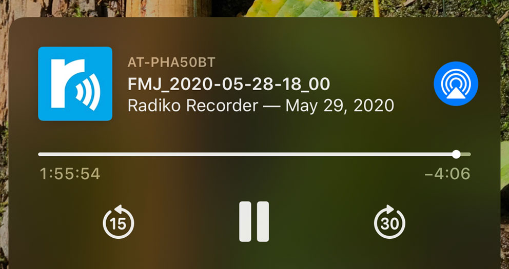
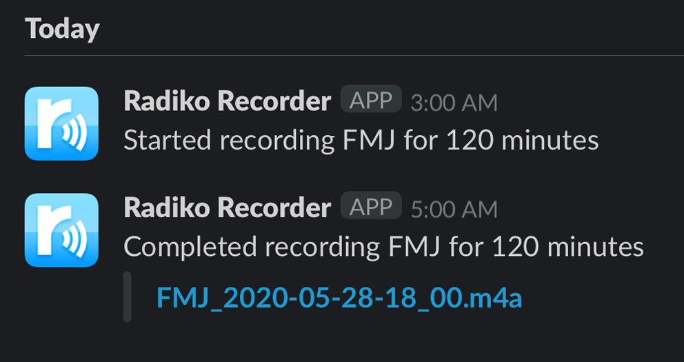
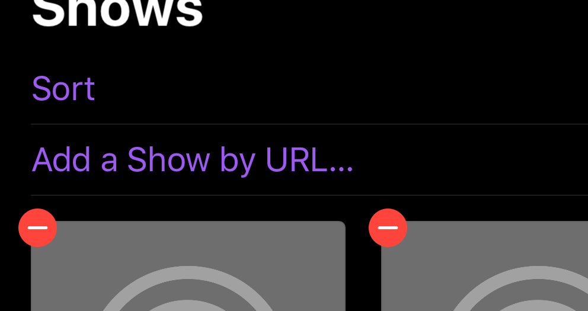

radiko の音声を録音するスクリプト Cron で実行し、AWS S3 に保存する運用を5年ほど前から行っていましたが、毎度 S3 からダウンロードし、Music アプリなどに取り込む、という作業が億劫で、しばらく聞かずに保存するだけの状態が続いていました。

外部での打ち合わせが減り、事務所で一人作業することが増えたため、これを効率的に消化するべく、iOS, macOS の Podcast アプリで聞けるようにセットアップしました。

READMORE

## 構成

- [さくらの VPS / 東京第2ゾーン プラン 512](https://secure.sakura.ad.jp/order/vps/#/plan/plan-id/3417)
  - Ubuntu 18.04.4 LTS で Docker を実行
  - ECS Fargate で実行したかったが、起動に数分かかるので、予め docker pull しておき、すぐ docker run できるよう、常駐させている
- AWS
  - S3: 音声データを保存する先
  - Lambda: オブジェクトの作成 (音声データのアップロード) をハンドリングし、RSS を更新する
- Slack
  - 録音開始と終了を通知

## 定時実行用 Docker コンテナ

GitHub 上で公開されている [radish] というスクリプトを利用します。

radish をエントリーポイントとする Docker Image [atsnngs/radish] を、今回のユースケースのために拡張した [atsnngs/radiko-recorder-s3] を利用します。

```sh
docker pull atsnngs/radiko-recorder-s3:latest
```

起動に必要な環境変数を設定ファイルに記載します。

```sh
# ~/.radikorc
RADIKO_LOGIN=...
RADIKO_PASSWORD=...
S3_BUCKET=...
AWS_ACCESS_KEY_ID=AKIA...
AWS_SECRET_ACCESS_KEY=...
SLACK_WEBHOOK_URL=https://hooks.slack.com/services/....
SLACK_CHANNEL=...
```

Crontab に録音したい番組の時間に Docker コンテナが起動するよう、記述します。

```sh
0 0 * * 2 docker run --rm -e STATION=ALPHA-STATION -e DURATION_MINUTES=60 --env-file /home/ngs/.radikorc atsnngs/radiko-recorder-s3
```



ここまで設定すると、定時実行され、AWS S3 に 音声データが定時に保存され、上の画像の様に Slack チャネルに通知が飛びます。

## Podcast フィードの更新

Podcast RSS フィードを更新するための Lambda スクリプトを設定します。

一度つくったらしばらくメンテしないと考えたので、[SAM] や [Serverless] で構築の自動化などはせず、AWS Console のインラインエディタで実装しました。

雑に、XML パーサー & ビルダーの npm モジュールなども使わず、バケット上に存在する feed.xml の文字列加工だけを行い、バケットに新しい feed.xml を配置します。

初回バケットのルートに配置する feed.xml は、例えば、このようなものです。

```xml
<?xml version="1.0"?>
<rss xmlns:itunes="http://www.itunes.com/dtds/podcast-1.0.dtd" version="2.0">
  <channel>
    <title>Radiko Recorder</title>
    <link>https://github.com/ngs/docker-radiko-recorder-s3</link>
    <image>
      <url>https://mydomain.tld/icon.png</url>
      <title>Radiko Recorder</title>
      <link>https://github.com/ngs/docker-radiko-recorder-s3</link>
    </image>
    <description>My Radiko Recordings</description>
    <language>ja-jp</language>
    <copyright>Personal Use Only</copyright>
    <lastBuildDate>Thu, 28 May 2020 20:02:33 GMT</lastBuildDate>
    <itunes:author>Radiko Recorder</itunes:author>
    <itunes:summary>My Radiko Recordings</itunes:summary>
    <itunes:subtitle>Personal Use</itunes:subtitle>
    <itunes:owner>
      <itunes:name>Atsushi Nagase</itunes:name>
      <itunes:email>a@ngs.io</itunes:email>
    </itunes:owner>
    <itunes:explicit>No</itunes:explicit>
    <itunes:keywords/>
    <itunes:image href="https://mydomain.tld/icon.png"/>
    <itunes:category text="Music"/>
    <pubDate>Thu, 28 May 2020 20:02:33 GMT</pubDate>
  </channel>
</rss>
```

インラインエディタに以下のスクリプトを貼り付けます。

```js
const AWS = require('aws-sdk');
const s3 = new AWS.S3();

exports.handler = async (event) => {
    const filename = 'feed.xml';
    const { bucket, object } = event.Records[0].s3;
    const { eventTime, awsRegion } = event.Records[0];
    const date = new Date(eventTime).toUTCString();
    console.info(JSON.stringify(event, null, 2));
    const res = await s3.getObject({ Bucket: bucket.name, Key: filename }).promise();
    let xml = res.Body.toString('utf-8').replace(/\s*<\/channel>[\n\s]*<\/rss>/, '').split('<item>');
    xml[0] = xml[0].replace(/<pubDate>[^<]+<\/pubDate>/, `<pubDate>${date}</pubDate>`);
    xml[0] = xml[0].replace(/<lastBuildDate>[^<]+<\/lastBuildDate>/, `<lastBuildDate>${date}</lastBuildDate>`);
    while(xml.length > 49) {
        xml.pop();
    }
    const url = `https://${bucket.name}.s3.${awsRegion}.amazonaws.com/${object.key}`;
    xml.splice(1, 0, `
          <title>${object.key.replace(/\.m4a$/, '')}</title>
          <link>${url}</link>
          <pubDate>${date}</pubDate>
          <description></description>
          <enclosure url="${url}" length="${object.size}" type="audio/m4a" />
          <guid>${url}</guid>
          <itunes:explicit>no</itunes:explicit>
        </item>`)
    await s3.putObject({
        ACL: 'public-read',
        Body: xml.join('<item>').replace(/\s*\n+\s*/g, '') + '</channel></rss>',
        Bucket: bucket.name,
        ContentType: 'application/rss+xml',
        Key: filename,
    }).promise();
    return null;
```

トリガーを以下のように設定します。

- イベント: すべてのオブジェクト作成イベント
- サフィックス: .m4a

以上で、m4a の配置を契機に feed.xml が更新されます。



iOS, macOS の Podcast アプリより、S3 の URL を設定してください。

```
https://${バケット名}.s3.${リージョン}.amazonaws.com/feed.xml
```


以上で設定はすべて完了です。一般的な Podcast と同じ様に、録音された番組がエピソードとして表示されます。

個人の趣味の範囲で活用いただければとおもいます。

[radish]: https://github.com/uru2/radish
[atsnngs/radish]: https://hub.docker.com/r/atsnngs/radish/
[atsnngs/radiko-recorder-s3]: https://hub.docker.com/r/atsnngs/radiko-recorder-s3/
[Serverless]: https://www.serverless.com/
[SAM]: https://aws.amazon.com/serverless/sam/
