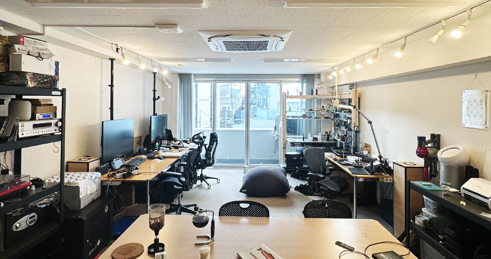
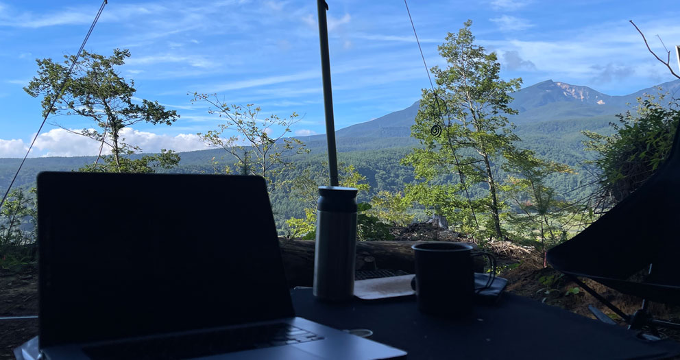
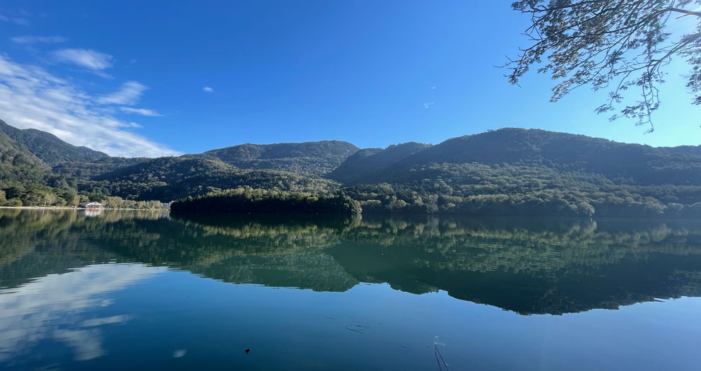
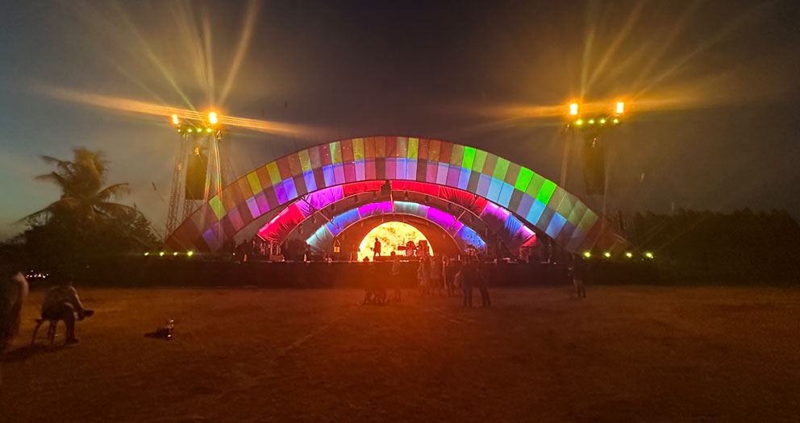
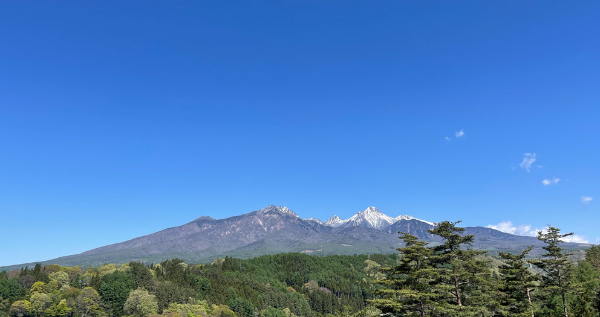

今年は娘の高校受験のため、東京で大晦日を迎えています。

報告すべきことがいくつかあったのですが、毎年書いている、[所感](/t/所感/) エントリーで、まとめて報告させていただきます。

READMORE

## 仕事・技術

今年は [インスタンスゼロ] でのコンサルティング・ソフトウェア開発をメインにしながら、いくつかの新規事業の立ち上げに関する企画・開発業務も行っていました。

そのなかの複数が、現在も進行中で、自分も名前を出して活動をするので、2023 年内には告知できるかと思います。

技術的には、TypeScript (Next.js/React.js)、SwiftUI、Go、GraphQL を主に利用して、ウェブアプリ、iOS/iPadOS/watchOS アプリ、コマンドラインツールなどを開発していました。

オンラインメインの弊害で、日中ビデオ会議がみっちり入ってしまい、集中して制作に取り組めないことも多かったので、今後は、意図的に作業時間をスケジュールに入れる運用をしていこうと思います。

10 月、下目黒 3 丁目にあるオノダビルの事務所を解体に伴う立ち退きのため、旧事務所から徒歩 5 分もかからない、下目黒 2 丁目にある、目黒第一花谷ビルに拠点を移しました。

[2019 年の開設](/2019/11/01/ins0-fudomae/) よりとても気に入っていたオノダビルをあとにするのは残念でしたが、新しい事務所は共有部分や設備が充実しており、とても快適に活用しています。

旧事務所にあった、階段下スペースがなくなり、お手洗いが共用になったので、ほぼ同じ専有面積ですが、間取りに余裕ができたので、ラックを増やし、音響機材を自宅から移設しました。

社外からも人を招いて、集まれる機会を作りたいと思います。

## 旅行・釣り・趣味

今年のキャンプ泊はフェスのテント泊を含まず、22 泊でした。

釣行は 4 回。毛針も在庫を切らしており、情熱がなくなったわけではないですが、仕事とライブに比べて、優先度を下げていました。

来年はフェス後の延泊で釣り場に近い場所を選んだりしながら、もう少し積極的に釣り活動を行いたいと思います。

今年は、比較的近場のキャンプ場で、連泊も少なめだったのですが、来年は連泊で渓流に近い場所でキャンプをしようと計画しています。

特に、大好きな金峰山川沿いの [ふれあいの森 キャンプ場](http://w2.avis.ne.jp/~mawarime/fureai.htm) にシーズン中行けなかったことを後悔しているので、次シーズンこそは必ず訪れたいと思います。

ガーラ湯沢の回数券を買ったのに、使い切れなかったり、秋川漁協の年券を買ったのに、管理域に一度しか釣行できていないなど、勿体ないことをしたので、次シーズンはちゃんと使いこなしたいと思います。(ガーラ回数券は購入済)

模型は、大物に 2 つ着手したのと、時間もあまり取れなかった都合で、今年完成させたものはありません。

[アオシマの DD51](https://www.aoshima-bk.co.jp/product/4905083061824/) を制作途中ですが、進捗は 80% ほどで、塗装済み内部パーツを眺めているだけで満足している感じがあります。

- 01/17 スキー @ ガーラ湯沢
- 01/21-22 [白州・尾白の森名水公園べるが]
- 02/12-13 [negura campground]
- 03/07-08 大岳沢釣行 [大岳キャンプ場] 泊
- 04/02-03 [イレブンオートキャンプ場] w/同業者いつメン
- 04/10-12 [養沢毛鉤専用釣場] [大岳キャンプ場] 泊
- 05/01-02 [河津七滝オートキャンプ場]
- 05/03-05 [コート·ドゥ·ヴェール] w/家族
- 06/15-16 京都 (Brian Eno 展見に)
- 06/19-21 [白州・尾白の森名水公園べるが]
- 07/01-02 [ほったらかしキャンプ場]
- 08/05-10 京都 -> 尾道 -> 道後 w/家族+弟家族
- 09/04-06 [松原湖高原オートキャンプ場]
- 09/27-29 湯ノ湖釣行 [日光湯元キャンプ場] 泊
- 10/25-26 [養沢毛鉤専用釣場] [大岳キャンプ場] 泊
- 11/10-11 [白州・尾白の森名水公園べるが]
- 11/11-13 祖母 3 回忌 帰省 w/長男
- 11/17-18 [negura campground]
- 12/06-08 札幌出張
- 12/10-11 [オートキャンプ七里川] w/同業者いつメン
- 12/14-19 タイ [Wonderfruit]
- 12/27-28 [negura campground] w/塩野

## 音楽・ライブ

パンデミックで "自粛" されていたイベントたちも、今年は以前と同様にとまでは言わないものの、開催が増え、海外アーティストの来日も行われていたので、充実したエンタメ生活を過ごせました。

今年から、お笑いと映画もリストに追加しました。が、映画を一回しか鑑賞できていないことに、振り返ってみて気付いたので、来年は意識的に映画館に脚を運びたいと思います。

子供たちが大きくなり、子供と二人でライブに行けたり、留守番をお願いして、妻と二人でライブに行く機会が増えました。

家族と趣味を共有できるのは、嬉しいことです。

12 月には、タイの大型音楽フェスティバル、[Wonderfruit] に初参加しました。

バンコク市内に一泊し、パタヤの会場に向かったあとは、現地のテントサイトでテント泊をしました。

Fuji Rock でテントでのフェス連泊は慣れているものの、初参加のフェス、かつ、異国のため、設備や衛生面に不安がありましたが、実際体験してみると、飲食にも困らず、シャワー (お湯は出ない) もあったので、快適に過ごせました。

現地は、常に快晴で、乾燥しており、砂埃がテントやラップトップ、衣類を砂まみれにしました。また、夜は半袖短パンでは少し肌寒かったです。そのため、水シャワーは、夜ではなく、日が昇って気温が上がってから利用していました。

- 01/04 なんばグランド花月 本公演 w/妻
- [01/08 NETWORKS ワンマン @ 7th Floor](https://tiget.net/events/153392)
- [01/30 ageHa THE GRAND FINAL](http://www.ageha.com/schedule/event/?id=341234)
- [01/31 ハイキングウォーキングの月締め報告会 @ ヨシモト ∞ ドーム ステージ II](https://warally.info/events/80985)
- [02/05 近藤芳正 Solo Work「ナイフ」 @ 東京芸術劇場 シアターイースト](https://sunrisetokyo.com/detail/15456/) w/妻
- [02/11 くるり 結成 25 周年記念公演 ～くるりの 25 回転～ @ 東京ガーデンシアター](https://quruli.net/qrl25kaiten/) w/妻
- [03/01 History of Fishmans @ Liquid Room](https://www.liquidroom.net/schedule/fishmans_20220301)
- [03/11 ZAZY BEST LIVE 『Z』 @ ヨシモト ∞ ホール](https://warally.info/events/85300)
- [03/16 Terry Riley @ Billboard Live Tokyo](http://www.billboard-live.com/pg/shop/show/index.php?mode=detail1&event=13286&shop=1)
- [03/25 平沢進 ZCON @ 東京ガーデンシアター](https://www.susumuhirasawa.online/zcon-info)
- [03/31 ハイキングウォーキングの月締め報告会 @ ヨシモト ∞ ドーム ステージ II](https://warally.info/events/85654)
- [04/09-10 The Wonderful World 2022 @ おおば村キャンプ場](https://zaiko.io/event/346517)
- [04/29-01 Rainbow Disco Club 2022 @ 東伊豆カントリーコース](https://rainbowdiscoclub.zaiko.io/item/345615)
- [05/14-05/15 FUJI & SUN '22](https://www.wowow.co.jp/detail/181043) w/家族
- 05/21 プラモお笑いライブ～ @ ヨシモト ∞ ドーム ステージ II
- [05/28-29 FFKT 2022](https://ffkt.jp/2022/)
- [06/05 機動戦士ガンダム ククルス・ドアンの島](https://g-doan.net/) w/長男
- [06/15 Brian Eno Ambient Kyoto](https://ambientkyoto.com/)
- [06/18-19 Sawagi Festival 2022](https://sawagifestival.com/)
- [06/26 FESTIVAL FRUE ZINHO](https://fruezinho.com/)
- [06/27 羊文学 TOUR 2022 "OOPARTS" @ Zepp DiverCity Tokyo](https://www.sonymusic.co.jp/artist/hitsujibungaku/info/540429) w/長女
- [07/03 bonobos TOUR 2022 迷わずに SAY！YES♡ @ Liquid Room](https://www.liquidroom.net/schedule/bonobos_20220703)
- [07/06 BUZZER#2 @ Shibuya Club Quattro](https://ganban.net/?p=66375)
- [07/20 The Spellbound @ Zepp Haneda](https://www.creativeman.co.jp/event/the-spellbound_2022_jul/)
- [07/23 NETWORKS ワンマン @ 7th Floor](https://tiget.net/events/181600)
- [07/28-08/01 Fuji Rock Festival 2022](https://www.fujirockfestival.com/) w/塩野
- [08/11 くるり ツアー @ Zepp Haneda](https://www.quruli.net/news/haneda/) w/妻
- [08/19 SONIC MANIA 2022](https://www.fashion-press.net/news/86246)
- [08/20 Tonalism an all-night ambient happening @ SUPER DOMMUNE + ComMunE](https://dublab.jp/show/tonalism2022/)
- [08/31 Sukiyaki Tokyo 2022 Day 2 @ WWW X](http://www.sukiyakitokyo.com/)
- [09/03-04 秘境祭](http://hikyousai.jp/)
- [09/10 ぺぺ祭 @ WWW](https://www-shibuya.jp/schedule/014683.php)
- [09/11 wind parade 2022](https://windparade.net/) w/妻
- [10/02 絆音楽祭(仮) @ お台場青海地区 P 区画](https://twitter.com/kizunamusicfes/status/1576535314021363712)
- [10/04 ELECTRIC DELAY LAND Vol.1 @ Liquid Room](https://www.liquidroom.net/schedule/electricdelaylandvol1_20221005) w/妻
- [10/08-09 朝霧 JAM 2022](https://asagirijam.jp/) w/塩野
- [10/15 電気グルーヴ ～みんなとみらいの YOU とぴあ～](https://pia-arena-mm.jp/event/2392) w/長男
- [10/26 坂本慎太郎 LIVE2022「Like A Fable」ツアー @ 昭和女子大学人見記念講堂](https://hall.swu.ac.jp/8374)
- [10/27 SQUAREPUSHER - JAPAN TOUR @ Shibuya O-East](https://shibuya-o.com/east/schedule/squarepusher-japan-tour-2/)
- 10/28 プラモお笑いライブ～ @ ヨシモト ∞ ドーム ステージ II
- [11/04 Polaris presents continuity @ 東京キネマ倶楽部](https://polaris-web.com/schedule/7792)
- [11/05-06 Festival de FRUE 2022](https://festivaldefrue.com/)
- [11/09 Bonobos untitled uTa domains @ Billboard Live Tokyo](http://www.billboard-live.com/pg/shop/show/index.php?mode=detail1&event=13567&shop=1) w/妻
- [11/15 Khurugangbin @ 豊洲 PIT](https://smash-jpn.com/live/?id=3706)
- [11/16 TESTSET @ Billboard Live Tokyo](http://www.billboard-live.com/pg/shop/show/index.php?mode=detail1&event=13672&shop=1)
- [11/21 Buffalo Daughter / Boris with TOKIE New Rock Universe @ Liquid Room](https://www.liquidroom.net/schedule/buffalodaughter_20221121)
- [11/23 KAKUBARHYTHM 20years Anniversary Special Vol.10 Final](https://kakubarhythm.com/live/post/10269) w/塩野
- [12/02 電気グルーヴ Zepp ツアー "みんなと未来と Y シャツと大五郎" @ Zepp Haneda](https://ticket.tv-asahi.co.jp/ex/project/denkigroove_zepp)
- [12/03 KIKAGAKU MOYO FINAL SHOW @ めぐろパーシモンホール 大ホール](https://kikagakumoyo.com/finalshow2022/)
- [12/15-18 Wonderfruit 2022](https://wonderfruit.co/)
- [12/23 蓮沼フィル L'ULTIMO BACIO Anno 22 消憶](https://www.red-hot.ne.jp/play/detail.php?pid=py23152) w/妻

## 健康

今年もランニング・長距離ライドはゼロでした。ジム通いも仕事や遠征でぼちぼちになっているので、習慣を取り戻さねばと思っています。

料理を作るのが楽しく、晩酌をしながらつまみ食いをしてしまい、食べ過ぎていると自覚としているのですが、体重が増えていないので、おそらく体が衰えているのだろうと思います。

自己検査でコロナウィルスの陽性がわかり、熱でダウンした瞬間がありましたが、一日寝たら回復し、仕事に復帰できました。自分の場合は、インフルエンザよりは症状が軽く、後遺症もなかったので、命拾いしました。

## 家族

長女が中 3、長男が小学 6 年生、次女が小学 2 年生になりました。

前述の通り、一緒にライブに行けたり、長男が自作キーボードに興味を持ったり、Minecraft の MOD 開発をはじめ、プログラミングに興味を持ってくれているので、共通の話題があり、仲良くできていると思います。

来年は長女の受験が終わるので、しばらくできていなかった家族旅行をする予定です。

[大岳キャンプ場]: http://ootakecave.com/
[養沢毛鉤専用釣場]: https://yozawafly.com/
[インスタンスゼロ]: https://ins0.jp/
[白州・尾白の森名水公園べるが]: https://www.verga.info/
[オートキャンプ七里川]: https://www.city.kimitsu.lg.jp/site/kanko/10224.html
[negura campground]: https://linktr.ee/negura
[日光湯元キャンプ場]: http://www.nikkoyumoto-vc.com/guide/
[イレブンオートキャンプ場]: https://www.eleven-camp.com/
[河津七滝オートキャンプ場]: https://www.nanatakiauto.com/
[コート·ドゥ·ヴェール]: https://kiyosato-auberge.com/cote-de-vert/
[松原湖高原オートキャンプ場]: http://www.matsubarako-kogen.jp/
[ほったらかしキャンプ場]: https://hottarakashicamp.com/
[wonderfruit]: https://wonderfruit.co/
