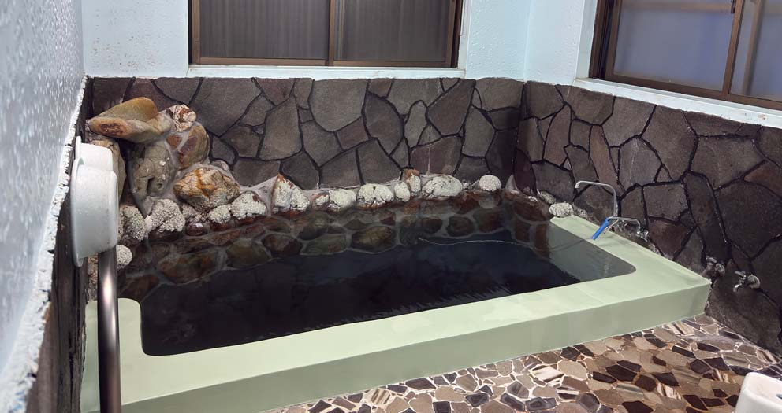
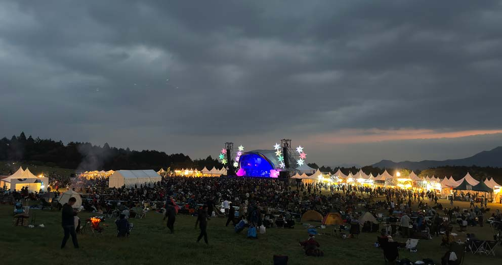
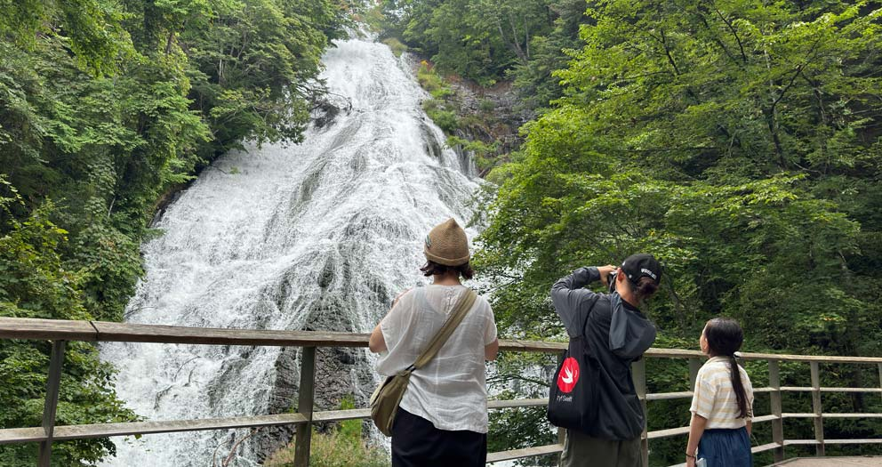

今年は、大阪府の島本町にある、実家で大晦日を迎えてます。

例年に倣って、[所感](/t/所感/) エントリーで一年を振り返ります。

READMORE

## 仕事・技術

今年の [インスタンスゼロ] での業務は、新規案件が少なく、数年前からお手伝いさせていただいている、大手メーカーの R&D 事業のお手伝いがメインでした。

他の仕事では、既存のウェブシステムの機能拡張や、内部運用ツールの開発などを請け負っていました。

新規立ち上げの案件がなく、スケジュールに余裕があるため、激しく納期に追われることのない、比較的落ち着いた一年でした。

7月には、以前 Modelmap 株式会社としてリリースし、法人閉鎖後、配布が停止していた、Modelmap Analyzer を、インスタンスゼロ株式会社として、再度提供開始しました 。

[Excelのセル依存関係を簡単に可視化！Modelmap Analyzer を Microsoft 365 と Google Sheets 向けに公開](https://ins0.jp/news/modelmap-analyzer)

並行して、一昨年立ち上げて、構築を続けている、[enkake 社] にて、温泉関連の事業のサービス開発を行っています。

関係者が多く、まだ、大々的にリリースは行っていないのですが、ひっそりとローンチしていたりします。

その他は、RC を使った自動操縦のテストや、Vision Pro を使ったソフトウェアの試作などを行っています。

来年は、温泉サービスを引き続き、軌道に乗せるべく開発を進めていくのと、単独の新規アプリをいくつかリリースしたいと思います。

## 旅行・釣り・趣味

今年は、一昨年に入門した、ベイトタックルを使ったソルトルアーフィッシングに一番多く時間を費やしていました。

カヤックも導入し、釣果はボチボチ出せるようになってきましたが、まだ満足な再現性がないので、来年も精進します。

車中泊や、自社や友人がかりている住宅泊で釣行することが多く、釣行を目的とした、テント泊はたった9泊でした。

釣行しているフィールドが河口・磯という都合上、これは来年も同じ状況になりそうです。

渓流・湖でのフライフィッシングも、継続していくので、釣り方については、絞り込まずに、色々楽しんでいければと思います。

ホビー関連は、プラモデルの作品は一つもなく、その代わりに、RC キットをいくつか作り、サーキットで練習を行っていました。

操縦スキル的に、まだ、レースにでる自信が着いていないので、来年は、そのスキルアップを重点的に目指していこうと思います。

プラモデルは、たまの息抜きに、一作品ほど新規に、あとは、作り途中のものを完成まで持って行くのを目標にします。

こちらは、一人で楽しむ趣味として続けていくので、展示会やコンテストは意識せず、マイペースに楽しむ予定です。

- 01/13-14 同業者キャンプ at [ハイガーデン]
- 01/27-28 京都
- 02/07 スキー @ ガーラ湯沢
- 03/18-20 大岳沢釣行 [大岳キャンプ場] 泊
- 03/26-28 蔵王
- 03/31-04/01 同業者キャンプ at [イレブンオートキャンプ場]
- 04/21-23 [河津七滝オートキャンプ場]
- 05/03-06 奄美大島
- 06/11-13 湯ノ湖
- 06/29-30 同業者キャンプ
- 07/05-06 大岳沢釣行 [大岳キャンプ場] 泊
- 08/05-15 尾道 1泊 -> 六島 1泊 -> 鷺の巣温泉 1泊 -> 尾道 3泊 -> 実家 2泊
- 08/19 奥日光
- 09/29-10/01 [河津七滝オートキャンプ場]
- 10/05-06 [七里川温泉]
- 10/17-18 亀山湖 釣行 [レイクサイド亀山キャンプ場] 泊
- 10/26-27 同業者キャンプ
- 11/04-05 焼津 (FRUE 延泊)
- 11/10-11 [伊豆松崎町 一仙](https://izuseinan.com/stay/matsuzaki-cho/ryokan/issen/) (Bonna Pot 延泊)
- 11/16-17 [碓氷峠鉄道文化むら キャンプ](https://www.usuitouge.com/bunkamura/events/2137/)
- 11/30-12/02 河口湖 釣行 -> [Outdoor RC Fes 2024](https://www.tamiya.com/japan/event/tamiyaGP_20241014BLOCKHEADtpft) -> 河口湖 釣行
- 12/07-08 同業者キャンプ
- 12/10-18 タイ

## 音楽・ライブ

今年も、良い頻度でライブに通えたと思います。

2泊以上の フェス・レイブにもいくつか参加しましたが、来年は回数を減らして、釣りと RC のための時間を多く取ろうと思います。

- 01/11 [Jazztronik Special Live “New Languages” at Billboard Live Tokyo](https://www.billboard-live.com/tokyo/show?event_id=ev-14600)
- 01/31 [GOGO PENGUIN Japan Tour2024 at Spotify O-EAST](https://shibuya-o.com/east/schedule/gogo-penguin-japan-tour2024/)
- 02/01 [THE SPELLBOUND BIG LOVE Vol.3 at Liquid Room](https://www.liquidroom.net/schedule/biglove3_20240201)
- 02/02 [The Chemical Brothers For that beautiful feeling tour 2024 LIVE IN TOKYO](https://smash-jpn.com/chemicalbrothers2024/)
- 02/03 [PAT METHENY Dream Box Solo Tour at BLUE NOTE TOKYO](https://www.bluenote.co.jp/jp/lp/pat-metheny-2024/)
- 02/10 ["KAMINARI WORKS presents 『ULTIMATE MUZIK?!~NEW YEAR DX』 ~NETWORKSワンマンライブ~ 　"](http://7th-floor.net/event/kaminari-works-presents-%e3%80%8eultimate-muziknew-year-dx%e3%80%8f-networks%e3%83%af%e3%83%b3%e3%83%9e%e3%83%b3%e3%83%a9%e3%82%a4%e3%83%96-%e3%80%80/)
- 03/12 [くるり at Liquid Room](https://www.liquidroom.net/schedule/20240312_quruli)
- 03/24 [Two Buffalo Daughters at Poralis](https://polaris240324.peatix.com/)
- 03/29 [KNOWER JAPAN TOUR 2024 at UMEDA TRAD](https://www.beatink.com/products/detail.php?product_id=13826)
- 04/05 [EMMA HOUSE 0 at WOMB](https://www.womb.co.jp/event/2024/04/05/emma-house-0-2/)
- 04/19-21 [Rainbow Disco Club 2024](https://www.rainbowdiscoclub.com/)
- 05/25 [DEEP DIVE in sync with GHOST IN THE SHELL / 攻殻機動隊 at Zepp Shinjuku](https://theghostintheshell.jp/news/deep-dive)
- 06/23 [Body & SOUL Live in Japan 2024](http://www.bodyandsoul-japan.com/)
- 07/06 [FESTIVAL FRUEZINHO 2024 at 立川ステージガーデン](https://fruezinho.com/)
- 07/07 [Cornelius 30th Anniversary Set at 東京ガーデンシアター](https://www.cornelius-sound.com/tour_20240707.html)
- 07/13 [B.O.B. (Blessings On Blessings) vol.2 - ADDIS PABLO at 川崎 SUPERNOVA](https://runningsteady.zaiko.io/item/364375)
- 07/19 [TESTSET - LIQUIDROOM 20th ANNIVERSARY](https://www.liquidroom.net/schedule/testset_20240719)
- 07/25-29 [FUJI ROCK FESTIVAL 2024 at 苗場スキー場](https://www.fujirockfestival.com/)
- 08/16 [SONIC MANIA 2024 at 幕張メッセ](https://www.summersonic.com/2024/sonicmania/)
- 08/20 [FRUE presents Rhythm Sound and Magic ft.NAKIBEMBE & CHO CO PA](https://www.unit-tokyo.com/schedule/9983/)
- 09/02 [羊文学 TOUR 2024 "soft soul, prickly eyes" at KT Zepp Yokohama](https://www.sonymusic.co.jp/artist/hitsujibungaku/info/565073)
- 09/16 [Buffalo Daughter 360 Tour at 晴れたら空に豆まいて](http://haremame.com/schedule/77738/)
- 09/25 [「Jesus' Son」 勝井祐二 + ナカコー + 沼澤尚 at Poralis](https://polaristokyo.com/schedule/20240925)
- 09/28-29 [FFKT 2024 Izu Shirahama at ホテル伊豆急](https://ffkt.jp/2024-izushirahama/)
- 10/10 [LITTLE TEMPO Autumn Live “ワイワイ文化祭” at Club Asia](https://clubasia.jp/events/7297/)
- 10/12-13 [朝霧 JAM 2024](https://asagirijam.jp/)
- 10/20 [TESTSET at Zepp Shinjuku](https://www.red-hot.ne.jp/play/detail.php?pid=py25568)
- 11/02-03 [FESTIVAL de FRUE 2024 at つま恋リゾート彩の郷](https://festivaldefrue.com/)
- 11/08-10 [Bonna Pot 2024 at オートキャンプ銀河 西伊豆](https://www.ele-king.net/news/011535/)
- 11/22 [月見ル20周年記念公演Buffalo Daughter One Man Show](https://www.moonromantic.com/post/241122)
- 11/23 [Glitterbox Tokyo at Zero Tokyo](https://zerotokyo.jp/event/glitterbox-tokyo/)
- 12/12-16 [Wonderfruit 2024](https://wonderfruit.co/)
- 12/21 [The Ska Flames at Club Quattro](https://smash-jpn.com/live/?id=4298)
- 12/22 [Rec Off-Tone "Salon de Ambiguous" edition1 feat. Kaito](https://recofftone-kaito.peatix.com/)
- 12/27 [Jesus' Son with 内田直之 at Poralis](https://polaristokyo.com/schedule/20241228)

## 健康

釣行やフェスなどでバタバタ動き回っており、一度もジムにいけていない月もあったりしました。

あちこち動き回っていたわりには、大きな怪我もなく、安定して過ごせたと思います。

ロードバイクは、通勤と、釣行にたまに使っていますが、ランニングは、完全にお休みしています。

昨年実施した、八ヶ岳ランニングを、今年もやりたいなと思っていましたが、結局一度も現地に行けませんでした。(本当は峡北漁協の年券を買うぐらいまで企んでいたのですが...)

## 家族

長女が高2、長男が中2、次女が小学4年生になりました。

長女の学校が土曜日もあり、アルバイトもしていることから、一緒に行動する機会が数回しかありませんでしたが、例年は、長女・長男ともに、受験が控えているため、家族全員で行動する機会自体少なくなります。

また、再来年以降、どこにいこうか、楽しみに計画しながら、一年を過ごしていけたらと思います。

[enkake 社]: https://enkake.co.jp/
[ハイガーデン]: https://high-garden.jp/
[大岳キャンプ場]: http://ootakecave.com/
[イレブンオートキャンプ場]: https://www.eleven-camp.com/
[河津七滝オートキャンプ場]: https://www.nanatakiauto.com/
[七里川温泉]: https://shichirigawa-onsen.com/
[レイクサイド亀山キャンプ場]: https://www.nap-camp.com/chiba/15852
