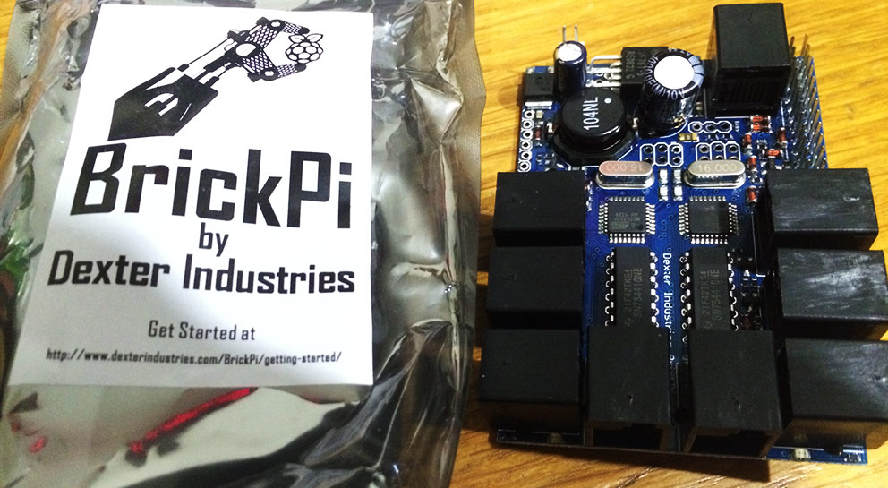

Mindstorms NXT のモジュール RaspberryPI で操る [BrickPi](http://www.dexterindustries.com/BrickPi/) キットが届きました。

READMORE

購入したのは [BrickPi Starter Bundle](http://www.dexterindustries.com/BrickPi.html)。

ケース、電池パック、SD カード 1枚、WiFI USB ドングル、Raspberry Pi Model B が入って、140.00 (キット価格) + 19.40 (バージニア州から東京までの送料) = 159.40 USD 也。

今年は、来週大きめのリリース作業 + 台湾旅行 の後、年末帰省で大阪なので、来年、戯れようと思います。

[Camera Module](http://www.raspberrypi.org/archives/3224) を調達済なので、手始めに自走遠隔カメラでもこしらえようかと思います。
